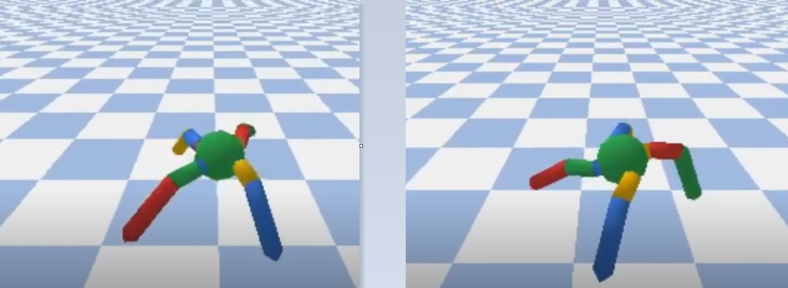
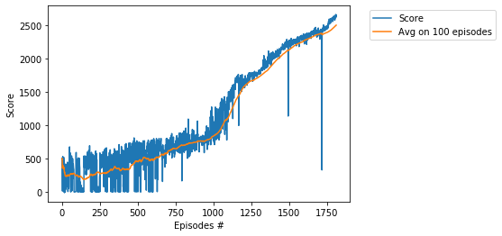

# Project - AntBulletEnv with Soft Actor Critic (SAC)

### Introduction

Solving the environment require an average total reward of over 2500 over 100 consecutive episodes.   
We solve the environment in __1811__ eposides, in __24__ hours, by usage of the __SAC__ algorithm,   
see the basic paper [SAC: Off-Policy Maximum Entropy Deep RL with a Stochastic Actor](https://arxiv.org/abs/1801.01290/).    

### Requirement
* [python 3.7.3](https://www.python.org) 
* [pytorch 1.2.0](https://pytorch.org/)
* [gym 0.13.1](https://github.com/openai/gym)
* [pybullet 2.5.6](https://pypi.org/project/pybullet/)

### Environment parameters

max steps in episode:  1000   
state space dimension:  28   
action space dimension:  Box(8,)   

### Hyperparameters

batch size: 256    
learning rate:  0.0001

### Entropy regularization  

A central feature of SAC is [entropy regularization](https://spinningup.openai.com/en/latest/algorithms/sac.html).     
The major difference with common RL algorithms is training to maximize a trade-off between     
expected return and entropy, a measure of randomness in the policy. This has a close connection     
to the exploration-exploitation trade-off: increasing entropy results in more exploration,   
which can accelerate learning later on. It can also prevent the policy from prematurely    
converging to a bad local optimum.

### Reparameterization Trick

This trick makes training converge better due to lower variance. See function _sample()_ in the class  
_GaussianPolicy_ from _model.py_. The reparameterization trick allows us to rewrite the expectation over actions   
(which contains a pain point: the distribution depends on the policy parameters) into an [expectation over noise](https://spinningup.openai.com/en/latest/algorithms/sac.html).

### Training Score

The threshold score **2500** was achieved in the episode **1811**  after training **24 hours**.

### Other SAC projects

* [BipedalWalker](https://github.com/Rafael1s/Deep-Reinforcement-Learning-Algorithms/tree/master/BipedalWalker-Soft-Actor-Critic)  
* [HopperBulletEnv](https://github.com/Rafael1s/Deep-Reinforcement-Learning-Algorithms/tree/master/HopperBulletEnv-v0-SAC)  
* [MinitaurBulletEnv](https://github.com/Rafael1s/Deep-Reinforcement-Learning-Algorithms/tree/master/Minitaur-Soft-Actor-Critic)  
* [MinitaurBulletDuckEnv](https://github.com/Rafael1s/Deep-Reinforcement-Learning-Algorithms/tree/master/MinitaurDuck-Soft-Actor-Critic)   
* [Walker2dBulletEnv](https://github.com/Rafael1s/Deep-Reinforcement-Learning-Algorithms/tree/master/Walker2DBulletEnv-v0_SAC)  

### The last few lines from the log

...   
Ep.: 1801, Total Steps: 1600122, Ep.Steps: 1000, Score: 2577.40, Avg.Score: 2479.95, Time: 23:52:46    
Ep.: 1802, Total Steps: 1601122, Ep.Steps: 1000, Score: 2618.20, Avg.Score: 2483.22, Time: 23:53:37   
Ep.: 1803, Total Steps: 1602122, Ep.Steps: 1000, Score: 2606.14, Avg.Score: 2485.22, Time: 23:54:29    
Ep.: 1804, Total Steps: 1603122, Ep.Steps: 1000, Score: 2616.03, Avg.Score: 2487.28, Time: 23:55:19    
Ep.: 1805, Total Steps: 1604122, Ep.Steps: 1000, Score: 2622.58, Avg.Score: 2489.45, Time: 23:56:10    
Ep.: 1806, Total Steps: 1605122, Ep.Steps: 1000, Score: 2657.32, Avg.Score: 2491.78, Time: 23:57:00     
Ep.: 1807, Total Steps: 1606122, Ep.Steps: 1000, Score: 2638.12, Avg.Score: 2493.87, Time: 23:57:51   
Ep.: 1808, Total Steps: 1607122, Ep.Steps: 1000, Score: 2633.31, Avg.Score: 2495.80, Time: 23:58:43   
Ep.: 1809, Total Steps: 1608122, Ep.Steps: 1000, Score: 2658.44, Avg.Score: 2498.11, Time: 23:59:34    
Ep.: 1810, Total Steps: 1609122, Ep.Steps: 1000, Score: 2624.06, Avg.Score: 2500.38, Time: 24:00:24   
Solved environment with Avg Score:   2500.383402639514   

Full log is available in the [jupyter notebook file](https://github.com/Rafael1s/Deep-Reinforcement-Learning-Algorithms/blob/master/Ant-PyBulletEnv-Soft-Actor-Critic/AntPyBulletEnv-SAC_lr0001-sc2500.ipynb).

### Videos  

See videos   
[Martian Ant](https://www.youtube.com/watch?v=s7aMZ1bbQgk&t=18s) and    
[Chessboard chase with four Pybullet actors](https://www.youtube.com/watch?v=NXX4GTim_NM) on youtube.  

### Articles on Soft Actor-Critic

* [Entropy in Soft Actor-Critic (Part 1)](https://towardsdatascience.com/entropy-in-soft-actor-critic-part-1-92c2cd3a3515)   
* [Entropy in Soft Actor-Critic (Part 2)](https://towardsdatascience.com/entropy-in-soft-actor-critic-part-2-59821bdd5671)

### Credit
The code is based on Pranjal Tandon's code (https://github.com/pranz24).
