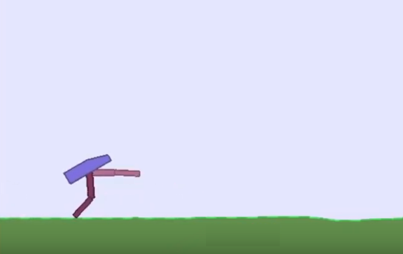
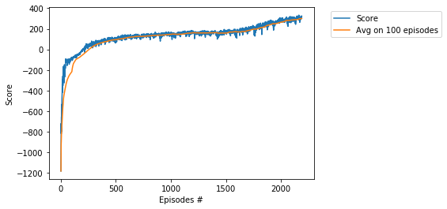

# Project - BipedalWalker with A2C, Vectorized Environment

### Introduction

Solving the environment require an average total reward of over 300 over 100 consecutive episodes.
Training of BipedalWalker is considered as [difficult task](https://ctmakro.github.io/site/on_learning/rl/bipedal.html), in particular, it is very difficult to train BipedalWalker by DDPG and PPO (with one agent). In this directory we solve the environment 
in **1646** (resp. **2188**) episodes by usage of the __A2C__ algorithm with RMSprop (resp. Adam) optimizer, see [Understanding Actor Critic Methods and A2C](https://towardsdatascience.com/understanding-actor-critic-methods-931b97b6df3f).
For other solutions (based on the single agent) see
[BipedalWalker-TD3](https://github.com/Rafael1s/Deep-Reinforcement-Learning-Algorithms/tree/master/BipedalWalker-TwinDelayed-DDPG%20(TD3))
and [BipedalWalker-SAC](https://github.com/Rafael1s/Deep-Reinforcement-Learning-Algorithms/tree/master/BipedalWalker-Soft-Actor-Critic).

     

### Requirement

* [python 3.7](https://www.python.org) 
* [pytorch 1.0.1](https://pytorch.org/)
* [gym 0.13.1](https://github.com/openai/gym)

### Advantage function

Q-values can be decomposed into two pieces: the _state-value_ function **V(s)** and    
the _advantage_ function **A(s, a)**:     
              
             Q(s, a)= V(s)+ A(s,a)   

where **s** is the current state, and **a** is the current action.              
The value function **V(s)** captures how good it is to be at the state **s**.     
The advantage function **A(s, a)** captures how better an action is compared to the others at a given state:

             A(s,a) = Q(s,a) - V(s)   
             A(s,a)= r + γV(s_next) - V(s)    
             
### Advantage Actor-Critic (A2C)             

Instead of having the critic to learn the _Q-values_ **Q(s,a)**, we make him learn the _advantage values_ **A(s,a)**. 
That way the evaluation of an action is based **not only on how good the action is**, but also **how much better it can be**,
see [The idea behind Actor-Critics](https://sergioskar.github.io/Actor_critics/).

### Training the Agent
We train the agent to understand that it can use information from its surroundings to inform the next best action.    
The score 300.5 was achieved    

* in the episode **1646** after training **11 hours 44 minutes**.
lr = **0.001**, optimizer = **RMSprop**.

 

* in the episode **2188** after training **14 hours 43 minutes**.
lr = **0.0005**, optimizer = **Adam**.

 

### Other BipedalWalker projects:

* [BipedalWalker, TD3](https://github.com/Rafael1s/Deep-Reinforcement-Learning-Algorithms/tree/master/BipedalWalker-TwinDelayed-DDPG%20(TD3))    
* [BipedalWalker, SAC](https://github.com/Rafael1s/Deep-Reinforcement-Learning-Algorithms/tree/master/BipedalWalker-Soft-Actor-Critic)    
* [BipedalWalker, PPO, Vectorized Env](https://github.com/Rafael1s/Deep-Reinforcement-Learning-Algorithms/tree/master/BipedalWalker-PPO-VectorizedEnv)  

### Credit   

Most of the code is based on the Udacity code, and Ilya Kostrikov's code (https://github.com/ikostrikov).     
["In my experience, A2C works better than A3C and ACKTR is better than both of them."](https://github.com/ikostrikov/pytorch-a3c)   
