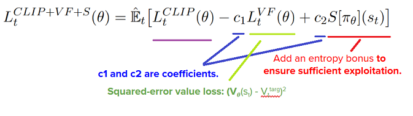
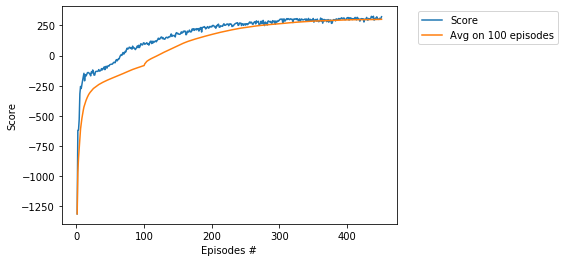

# Project - BipedalWalker with PPO, Vectorized Environment

### Introduction

Solving the environment require an average total reward of over 300 over 100 consecutive episodes.
Training of BipedalWalker is considered as [difficult task](https://ctmakro.github.io/site/on_learning/rl/bipedal.html), in particular, it is very difficult to train BipedalWalker by DDPG and PPO (with one agent). In this directory we solve the environment 
in **450** episodes by usage of the __PPO (with multi-agent)__ algorithm, see [Multi-Agent RL](https://bair.berkeley.edu/blog/2018/12/12/rllib/) or [Baseline doc](https://stable-baselines.readthedocs.io/en/master/modules/ppo2.html#note). For other solutions (based on the single agent) see
[BipedalWalker-TD3](https://github.com/Rafael1s/Deep-Reinforcement-Learning-Algorithms/tree/master/BipedalWalker-TwinDelayed-DDPG%20(TD3))
and [BipedalWalker-SAC](https://github.com/Rafael1s/Deep-Reinforcement-Learning-Algorithms/tree/master/BipedalWalker-Soft-Actor-Critic).

### Requirement

* [python 3.7](https://www.python.org) 
* [pytorch 1.0.1](https://pytorch.org/)
* [gym 0.13.1](https://github.com/openai/gym)

### Environment

The environment is simulated as list of 16 **gym** environments. They run in 16     
subprocesses adopted from [openai baseline](https://github.com/openai/baselines):

     num_processes=16
     envs = parallelEnv('BipedalWalker-v2', n=num_processes, seed=seed)       
     
### Hyperparameters

Agent uses the following hyperparameters:

_gamma=0.99_ # discount    
_epoch = 16_ # the parameter in the update mexanism of the PPO   
_mini_batch=16_ # optimizer and backward mechisms work after sampling BATCH elements   
_lr = 0.001_ # learning rate    
_eps=0.2_ # the clipping parameter using for calculation of the _action loss_   

### Update mechanism

Standard policy gradient methods perform one gradient update per data sample.     
In the [original paper](https://arxiv.org/abs/1707.06347) it was proposed a novel objective function that enables **multiple epochs**.   
This is  the **loss** function _L\_t(\\theta)_, which is (approximately) maximized each iteration:    

Parameters **c1**, **c2** and **epoch** are essential hyperparameters in the PPO algorithm.
In this agent, c1 = -0.5,   c2 = 0.01. 

                value_loss = (return_batch - values).pow(2)
                loss = -torch.min(surr1, surr2) + 0.5 * value_loss - 0.01 * dist_entropy 

The update is performed in the function **ppo_agent.update()**.

### Training the Agent

We train the agent to understand that it can use information from its surroundings to inform the next best action.     
The score **300.5** was achieved in the episode **450** after training **2 hours 33 minutes**.     

### Other PPO projects  

  * [Pong](../Pong-Policy-Gradient-PPO), 8 parallel agents
  * [Crawler](../Project-2_Continuous-Control-Crawler-PPO), 12 parallel agents
  * [CarRacing](../CarRacing-From-Pixels-PPO),  Single agent, Learning from pixels
  
### Other BipedalWalker projects:

* [BipedalWalker, TD3](https://github.com/Rafael1s/Deep-Reinforcement-Learning-Algorithms/tree/master/BipedalWalker-TwinDelayed-DDPG%20(TD3))    
* [BipedalWalker, SAC](https://github.com/Rafael1s/Deep-Reinforcement-Learning-Algorithms/tree/master/BipedalWalker-Soft-Actor-Critic)    
* [BipedalWalker, A2C, Vectorized Env](https://github.com/Rafael1s/Deep-Reinforcement-Learning-Algorithms/tree/master/BipedalWalker-A2C-VectorizedEnv)  
  
  
### Credit   

Most of the code is based on the Udacity code, and Ilya Kostrikov's code (https://github.com/ikostrikov).
     
