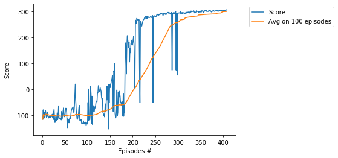
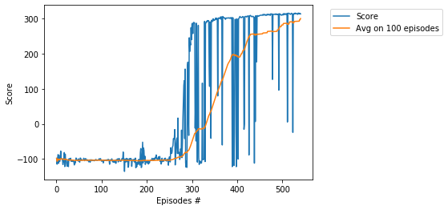

# Project - BipedalWalker with Soft Actor-Critic (SAC)

### Introduction

Solving the environment require an average total reward of over 300 over 100 consecutive episodes.
Training of BipedalWalker is considered as [difficult task](https://ctmakro.github.io/site/on_learning/rl/bipedal.html), in particular, it is very difficult to train BipedalWalker by DDPG and PPO (with one agent). We solve the environment 
by usage of the __SAC__ algorithm, see the basic paper [SAC: Off-Policy Maximum Entropy Deep RL with a Stochastic Actor](https://arxiv.org/abs/1801.01290/). For another solution (based on the single agent) see 
[BipedalWalker-TD3](https://github.com/Rafael1s/Deep-Reinforcement-Learning-Algorithms/tree/master/BipedalWalker-TwinDelayed-DDPG%20(TD3)). 

### Requirement

* [python 3.7](https://www.python.org) 
* [pytorch 1.0.1](https://pytorch.org/)
* [gym 0.13.1](https://github.com/openai/gym)
     
     
### Hyperparameters

Agent uses the following hyperparameters:

_gamma=0.99_ # discount    
_mini_batch=256_ # optimizer and backward mechisms work after sampling BATCH elements   
_lr = 0.0001_ # learning rate    
_eps=0.2_ # the clipping parameter using for calculation of the _action loss_   

### Entropy regularization

A central feature of SAC is [entropy regularization](https://spinningup.openai.com/en/latest/algorithms/sac.html).   
The major difference with common RL algorithms is training to maximize a trade-off between    
expected return and entropy, a measure of randomness in the policy. This has a close connection    
to the exploration-exploitation trade-off: increasing entropy results in more exploration,  
which can accelerate learning later on. It can also prevent the policy from prematurely    
converging to a bad local optimum.

#### Double-Q trick

Soft Actor Critic isn’t a direct successor to TD3 (having been published roughly concurrently),    
but it incorporates the clipped **double-Q trick**:    

        qf1, qf2 = self.critic(state_batch, action_batch) 
        qf1_loss = F.mse_loss(qf1, next_q_value) 
        qf2_loss = F.mse_loss(qf2, next_q_value) 
  
        pi, log_pi, _ = self.policy.sample(state_batch)

        qf1_pi, qf2_pi = self.critic(state_batch, pi)
        min_qf_pi = torch.min(qf1_pi, qf2_pi)

        policy_loss = ((self.alpha * log_pi) - min_qf_pi).mean() 
        
Two Q-functions are used to mitigate the positive bias in the policy improvement step.

### Off-policy

SAC is an **off-policy** algorithm. In other words, the SAC algorithm allows reusing the already collected data.
In the **agent.update_parameters** we get the batch of (_state, action, reward,  next_state, mask_)  of the _length = batch_size_:  

        memory = ReplayMemory(replay_size)
        ....
        
        # Sample a batch from memory, _batch_size_ = 256
        state_batch, action_batch, reward_batch, next_state_batch, mask_batch = memory.sample(batch_size=batch_size)

        state_batch = torch.FloatTensor(state_batch).to(self.device)
        next_state_batch = torch.FloatTensor(next_state_batch).to(self.device)
        action_batch = torch.FloatTensor(action_batch).to(self.device)
        reward_batch = torch.FloatTensor(reward_batch).to(self.device).unsqueeze(1)
        mask_batch = torch.FloatTensor(mask_batch).to(self.device).unsqueeze(1)
            
We compute the average of _policy_loss_ and _alpha_loss_  (entropy factor) over all elements of the    
_batch_ and perform the _backward propogation_ of these averages:

        self.policy_optim.zero_grad()  
        policy_loss.backward()   
        self.policy_optim.step()  
        ...  
        
        self.alpha_optim.zero_grad()
        alpha_loss.backward()
        self.alpha_optim.step()

### Video

See video [Four BipedalWalker Gaits](https://www.youtube.com/watch?v=PFixqZEYKh4) demonsrating 
4 different BipedalWalker-walks related with 4 different sets of SAC-hyperparameters.

### Training the Agent

We train the agent to understand that it can use information from its surroundings to inform the next best action. 
The score **300.5** was achieved 

* in the episode **408** after training  **7 hours 29 minutes**.    
   lr = 0.00008. 

* in the episode **540** after training  **4 hours 41 minutes**.    
   lr = 0.0005

* in the episode **756** after training  **13 hours 5 minutes**.    
   lr = 0.0001

### Other BipedalWalker projects

* [BipedalWalker, TD3](https://github.com/Rafael1s/Deep-Reinforcement-Learning-Algorithms/tree/master/BipedalWalker-TwinDelayed-DDPG%20(TD3))    
* [BipedalWalker, PPO, Vectorized Env](https://github.com/Rafael1s/Deep-Reinforcement-Learning-Algorithms/tree/master/BipedalWalker-PPO-VectorizedEnv)  
* [BipedalWalker, A2C, VectorizedEnv](https://github.com/Rafael1s/Deep-Reinforcement-Learning-Algorithms/tree/master/BipedalWalker-A2C-VectorizedEnv)  
  
### Other Soft Actor-Critic  projects    

* [AntBulletEnv](https://github.com/Rafael1s/Deep-Reinforcement-Learning-Algorithms/tree/master/Ant-PyBulletEnv-Soft-Actor-Critic)     
* [HopperBulletEnv](https://github.com/Rafael1s/Deep-Reinforcement-Learning-Algorithms/tree/master/HopperBulletEnv-v0-SAC)   
* [MinitaurBulletEnv](https://github.com/Rafael1s/Deep-Reinforcement-Learning-Algorithms/tree/master/Minitaur-Soft-Actor-Critic)    
* [MinitaurBulletDuckEnv](https://github.com/Rafael1s/Deep-Reinforcement-Learning-Algorithms/tree/master/MinitaurDuck-Soft-Actor-Critic)   
* [Walker2dBulletEnv](https://github.com/Rafael1s/Deep-Reinforcement-Learning-Algorithms/tree/master/Walker2DBulletEnv-v0_SAC)    

### The last few lines from the log    

...   
Ep.: 397, Total Steps: 433858, Ep.Steps: 921, Score: 305.46, Avg.Score: 299.45, Time: 07:19:50    
Ep.: 398, Total Steps: 434802, Ep.Steps: 944, Score: 304.52, Avg.Score: 299.57, Time: 07:20:46    
Ep.: 399, Total Steps: 435723, Ep.Steps: 921, Score: 305.65, Avg.Score: 299.69, Time: 07:21:40    
Ep.: 400, Total Steps: 436684, Ep.Steps: 961, Score: 303.97, Avg.Score: 299.78, Time: 07:22:38    
Ep.: 401, Total Steps: 437608, Ep.Steps: 924, Score: 306.29, Avg.Score: 299.90, Time: 07:23:33    
Ep.: 402, Total Steps: 438541, Ep.Steps: 933, Score: 304.28, Avg.Score: 299.99, Time: 07:24:28    
Ep.: 403, Total Steps: 439491, Ep.Steps: 950, Score: 304.15, Avg.Score: 300.09, Time: 07:25:24    
Ep.: 404, Total Steps: 440417, Ep.Steps: 926, Score: 305.15, Avg.Score: 300.21, Time: 07:26:19    
Ep.: 405, Total Steps: 441320, Ep.Steps: 903, Score: 305.71, Avg.Score: 300.27, Time: 07:27:13    
Ep.: 406, Total Steps: 442235, Ep.Steps: 915, Score: 306.88, Avg.Score: 300.44, Time: 07:28:07    
Ep.: 407, Total Steps: 443146, Ep.Steps: 911, Score: 305.48, Avg.Score: 300.56, Time: 07:29:01    
Solved environment with Avg Score:   300.56121912236614   

Full log is available in the [jupyter notebook file](https://github.com/Rafael1s/Deep-Reinforcement-Learning-Algorithms/blob/master/BipedalWalker-Soft-Actor-Critic/BipedalWalker-SAC_lr00008_408epis.ipynb).   

  
### Credit   

Based on Pranjal Tandon's code (https://github.com/pranz24).
     
