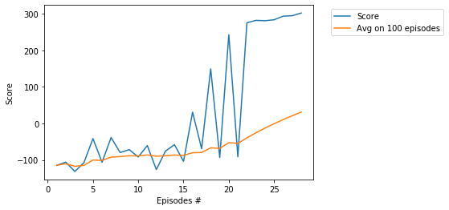

# Project - BipedalWalker with Soft Actor Critic (SAC)

### Introduction

Solving the environment require an average total reward of over 300 over 100 consecutive episodes.
Training of BipedalWalker is considered as [difficult task](https://ctmakro.github.io/site/on_learning/rl/bipedal.html), in particular, it is very difficult to train BipedalWalker by DDPG and PPO (with one agent). In this directory we solve the environment 
in **280** episodes by usage of the __SAC__ algorithm, see [SAC: Off-Policy Maximum Entropy Deep RL with a Stochastic Actor](https://arxiv.org/abs/1801.01290/). 
Another solution (based on the single agent) is given in this repository is
[BipedalWalker-TD3](https://github.com/Rafael1s/Deep-Reinforcement-Learning-Udacity/tree/master/BipedalWalker-TwinDelayed-DDPG%20(TD3)). 

### Requirement

* [python 3.7](https://www.python.org) 
* [pytorch 1.0.1](https://pytorch.org/)
* [gym 0.13.1](https://github.com/openai/gym)
     
     
### Hyperparameters

Agent uses the following hyperparameters:

_gamma=0.99_ # discount    
_mini_batch=256_ # optimizer and backward mechisms work after sampling BATCH elements   
_lr = 0.0001_ # learning rate    
_eps=0.2_ # the clipping parameter using for calculation of the _action loss_   

### Entropy regularization

A central feature of SAC is [entropy regularization](https://spinningup.openai.com/en/latest/algorithms/sac.html).   
The major difference with common RL algorithms is training to maximize a trade-off between    
expected return and entropy, a measure of randomness in the policy. This has a close connection    
to the exploration-exploitation trade-off: increasing entropy results in more exploration,  
which can accelerate learning later on. It can also prevent the policy from prematurely    
converging to a bad local optimum.

#### Double-Q trick

Soft Actor Critic isn’t a direct successor to TD3 (having been published roughly concurrently),    
but it incorporates the clipped **double-Q trick**:    

        qf1, qf2 = self.critic(state_batch, action_batch) 
        qf1_loss = F.mse_loss(qf1, next_q_value) 
        qf2_loss = F.mse_loss(qf2, next_q_value) 
  
        pi, log_pi, _ = self.policy.sample(state_batch)

        qf1_pi, qf2_pi = self.critic(state_batch, pi)
        min_qf_pi = torch.min(qf1_pi, qf2_pi)

        policy_loss = ((self.alpha * log_pi) - min_qf_pi).mean() 
        
Two Q-functions to mitigate positive bias in the policy improvement step

### Training the Agent

We train the agent to understand that it can use information from its surroundings    
to inform the next best action. The score **300.5** was achieved in the episode **280** after training 
**4 hours 41 minutes**.     

  
### Credit   

Most of the code is based on the Udacity code for PPO, and the github code of Pranjal Tandon (pranz24).
     
