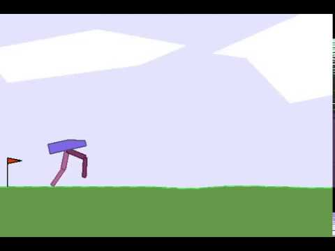
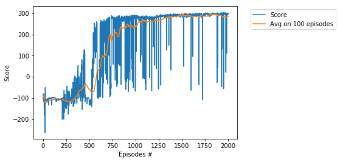
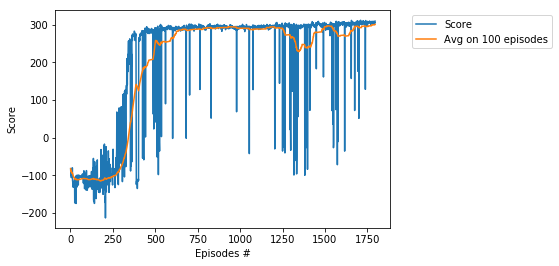
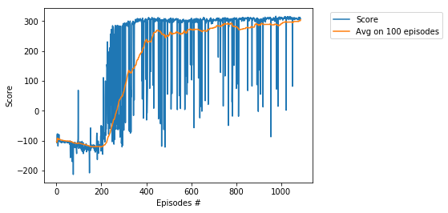

# Project - BipedalWalker with Twin Delayed DDPG (TD3)    

### Environment  

Solving the environment require an average total reward of over 300 over 100 consecutive episodes.  
Training of BipedalWalker is considered as [difficult task](https://ctmakro.github.io/site/on_learning/rl/bipedal.html), 
in particular, it is very difficult to train BipedalWalker by DDPG. In this directory we solve the environment in __1795 episodes__
by usage of the __Twin Delayed DDPG (TD3)__ algorithm, see the basic paper [Addressing Function Approximation Error in Actor-Critic Methods](https://arxiv.org/abs/1802.09477).
For another solution (based on the single agent), see [BipedalWalker-Soft-Actor-Critic](https://github.com/Rafael1s/Deep-Reinforcement-Learning-Algorithms/tree/master/BipedalWalker-Soft-Actor-Critic).

### Three TD3 tricks   

A common failure mode for DDPG is that the learned Q-function begins to dramatically overestimate Q-values,      
which then leads to the policy breaking, because it exploits the errors in the Q-function.     
Twin Delayed DDPG (TD3) is an algorithm which addresses this issue by [introducing three critical tricks:](https://spinningup.openai.com/en/latest/algorithms/td3.html)

* **Trick One:** Clipped Double-Q Learning. TD3 learns two Q-functions instead of one (hence “twin”),        
and uses the smaller of the two Q-values to form the targets in the Bellman error loss functions.      

* **Trick Two:**  “Delayed” Policy Updates. TD3 updates the policy (and target networks) less frequently      
than the Q-function. The paper recommends one policy update for every two Q-function updates.   
See parameter **policy_freq**  in the function _train()_, _class TD3_.

* **Trick Three**: Target Policy Smoothing. TD3 adds noise to the target action, to make it harder   
for the policy to exploit Q-function errors by smoothing out Q along changes in action.   
See parameter **policy_noise**  in the function _train()_, _class TD3_.

            # Select action according to policy and add clipped noise 
            noise = torch.FloatTensor(u).data.normal_(0, policy_noise).to(device)
            noise = noise.clamp(-noise_clip, noise_clip)
            next_action = (self.actor_target(next_state) + noise).clamp(-self.max_action, self.max_action)

Together, these three tricks result in substantially improved performance over baseline DDPG.    

### Off-policy

TD3 is an **off-policy** algorithm. In other words, the TD3 algorithm allows reusing the already collected data.
In the **agent.train** we get the batch of (_state, action, next_state, done, reward_)  of the _length = batch_size_:  

            # Sample replay buffer 
            x, y, u, r, d = replay_buffer.sample(batch_size)
            state = torch.FloatTensor(x).to(device)
            action = torch.FloatTensor(u).to(device)
            next_state = torch.FloatTensor(y).to(device)
            done = torch.FloatTensor(1 - d).to(device)
            reward = torch.FloatTensor(r).to(device)
            
We compute the average of _actor_loss_ over all elements of the _batch_ and perform the _backward propogation_
of this average:

                # Compute average for actor loss
                actor_loss = -self.critic.Q1(state, self.actor(state)).mean()
                # Optimize the actor 
                self.actor_optimizer.zero_grad()
                actor_loss.backward()
                self.actor_optimizer.step()

### Video

 See video [BipedalWalker by Training Stages](https://www.youtube.com/watch?v=g01mIFbxVns) demonstrating 5 different
 levels of the TD3 training. 

### Training History

1.  Score 293, Achieved in 2000 episodes   

2.  Score 300.5, Achived in 1795 episodes   
     

3. Score 304, Achieved in 1086 episodes

More points in fewer episodes. It happens!

### BipedalWalker, differenet models:   

* [BipedalWalker, SAC](https://github.com/Rafael1s/Deep-Reinforcement-Learning-Algorithms/tree/master/BipedalWalker-Soft-Actor-Critic)    
* [BipedalWalker, PPO, Vectorized Env](https://github.com/Rafael1s/Deep-Reinforcement-Learning-Algorithms/tree/master/BipedalWalker-PPO-VectorizedEnv)  
* [BipedalWalker, A2C, Vectorized Env](https://github.com/Rafael1s/Deep-Reinforcement-Learning-Algorithms/tree/master/BipedalWalker-A2C-VectorizedEnv)  

### Other TD3 projects   

* [HalfCheetahBulletEnv](https://github.com/Rafael1s/Deep-Reinforcement-Learning-Algorithms/tree/master/HalfCheetahBulletEnv-TD3)
* [HopperBulletEnv](https://github.com/Rafael1s/Deep-Reinforcement-Learning-Algorithms/tree/master/HopperBulletEnv_v0-TD3)
* [MountainCarContinuous](https://github.com/Rafael1s/Deep-Reinforcement-Learning-Algorithms/tree/master/MountainCarContinuous-TD3)   
* [Walker2DBulletEnv](https://github.com/Rafael1s/Deep-Reinforcement-Learning-Algorithms/tree/master/Walker2DBulletEnv-v0_TD3)

### Credit   

The source paper is [Addressing Function Approximation Error in Actor-Critic Methods](https://arxiv.org/abs/1802.09477)   
by _Scott Fujimoto_ , _Herke van Hoof_, _David Meger_.  

### References
* [TD3: Learning To Run With AI](https://towardsdatascience.com/td3-learning-to-run-with-ai-40dfc512f93).  
"_TD3 is the successor to the Deep Deterministic Policy Gradient (DDPG)(Lillicrap et al, 2016).     
 Up until recently, DDPG was one of the most used algorithms for continuous control problems such as robotics and autonomous driving._"  
 
 * [Addressing Function Approximation Error in Actor-Critic Methods](https://arxiv.org/abs/1802.09477).   
 "_TD3 maintains a pair of critics along with a single actor._"   
 "_...to address the coupling of value and policy, we propose delaying policy updates until the value estimate has converged._"   
 "_Unlike the original implementation of DDPG, we used uncorrelated noise for exploration._"
 
 
 
 
 
