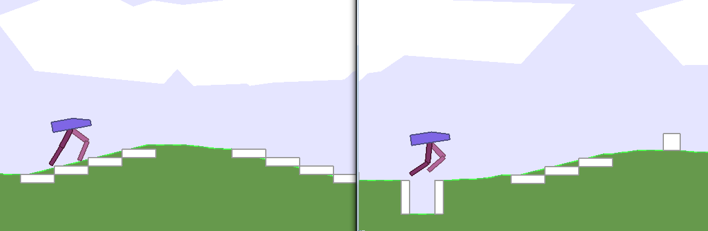
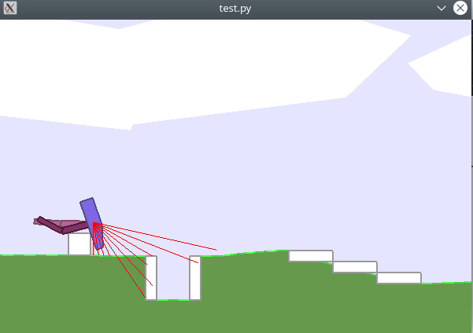
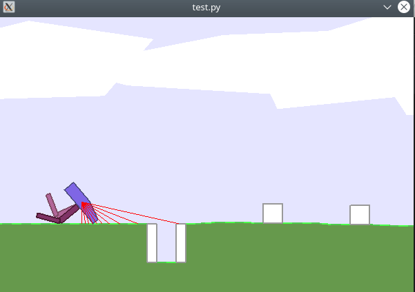
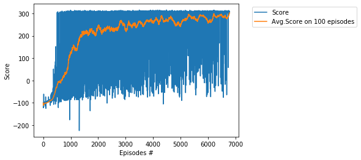
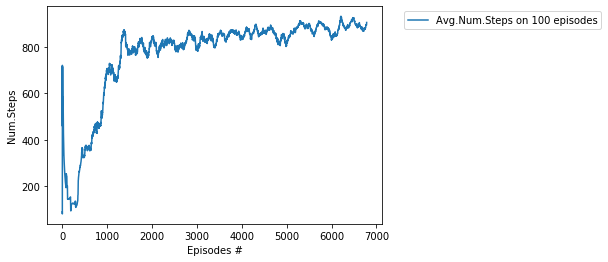
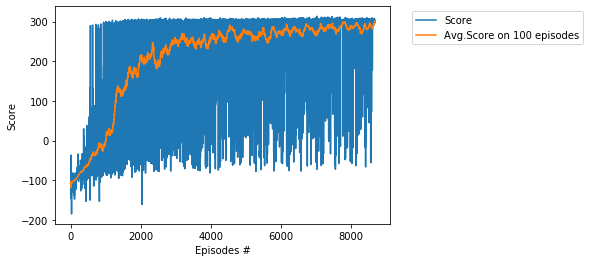
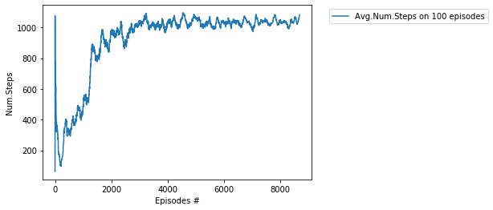

# Project - BipedalWalkerHardcore with TD3-FORK    

### Environment  

Solving the environment require an average total reward of over 300 over 100 consecutive episodes.    
Training of BipedalWalkerHardcore is considered as difficult task.   
In particular, it is very difficult to train BipedalWalkerHardcore by DDPG and TD3.   

__BipedalWalkerHardcore-v2__ has been bumped to __BipedalWalkerHardcore-v3__ with fixes of [Jan 31, 2020](https://ai.stackexchange.com/questions/13848/has-anyone-been-able-to-solve-openais-hardcore-bipedal-walker-with-their-implem).    

["To expand on why DDPG doesn't solve it, when although buggy, 
BipedalWalkerHardcore-v2 is solvable: The solution landscape to this problem 
is as full of pits as the environment itself. 
To learn to leap over a pit in the environment for example, 
the agent must perform a complex sequence of actions 
that is difficult to discover by random chance. 
Each time it fails, it learns that being close to a pit is highly likely 
to result in a large penalty, and in an effort to maximise it's rewards, 
will often remain stationary with a naive method like DDPG as the rewards 
for doing that are higher than trying and falling into the pit once more. 
In short, vanilla DDPG lacks enough exploration power 
to find the complex series of actions required before it converges 
on not going near the pit. Not to mention all of the other things 
it needs to learn to be successful."](https://ai.stackexchange.com/questions/13848/has-anyone-been-able-to-solve-openais-hardcore-bipedal-walker-with-their-implem).

In this directory we solve the environment:   
(1) in __6783 episodes__ in __18 h 47 m__   and    
(2) in __8681__ episodes in __24 h 42 m__       
by usage of the __TD3-FORK__ algorithm, see the basic paper [FORK: A Forward-Looking Actor For Model-Free Reinforcement Learning](https://arxiv.org/abs/2010.01652).

### Forward-Looking Actor Algorithm or FORK

The algorithm __FORK__ propose a new type of Actor (in the Actor-Critic framwework), named [Forwrd-Looking Actor](https://arxiv.org/abs/2010.01652).   

The neural network __Actor__ (policy) maps __states to actions__.  
The neural network __Critic__ (value) maps __(state, action) pair to Q-values__.  
The neural network __System__ forecasts __new state given current state and current action__.  

Generally speaking, FORK includes anothe network called __reward network__ that forecasts the reward based on the (state, action) pair.   
However, currently, we don't use this neural network.   

### System Network and Model-Based RL

The system model is not a new idea in Reinforcement Learning (RL). Historically, this type of RL was called 
the __Model-Based RL__ , see [Benchmarking Model-Based Reinforcement Learning](https://arxiv.org/abs/1907.02057).

Model-based reinforcement learning uses the model in a sophisticated way, often based on deterministic or stochastic   
optimal control theory to optimize the policy based on the model.   
[FORK only uses the system network as a blackbox to forecast future states, and does not use it as a mathematical model
for optimizing control actions. With this key distinction, any model-free Actor-Critic algorithm with FORK
remains to be model-free.](https://arxiv.org/abs/2010.01652).

### A bug in v2 Lidar tracing - Before fix and After fix
 Lidar is an acronym of "light detection and ranging".
 
[Finding this bug makes me even more impressed anyone has solved BipedalWalkerHardcore-v2 - it seems the observations from      
lidar have been inconsistent and incorrect, returning the furthest hit result instead of closest.In screenshots below, I've tweaked     
the lidar drawing routine to draw last (in front of terrain and objects) and draw every trace each frame to more clearly       
see what's happening.](https://github.com/openai/gym/pull/1789)     

Before fix - lidar traces through ground, and hits the side of a pit, giving the agent the impression of a "phantom canyon"    
in front of the pit:    

After fix - lidar is stopped by terrain, even when another object is behind it    

### A step ahead

[It seems to me that solutions to BipedalWalkerHardcore-v2 have not just learned to deal with the complex environment -    
but advanced a step ahead, and are able to deal with the complex environment and sensory hallucinations causing them to jump    
at the slightest hint of a cube, and keep running even when it looks like the ground is not visible below their feet,     
relying more on the touch sensor than the lidar, or perhaps recognising the difference in "shape" between a real pit and     
a "fake pit" (A real pit has a floor)](https://github.com/openai/gym/pull/1789)

### Training History

1. Score __303.7__,  achieved in __6783__ episodes

       Average number of steps:    

1. Score __301.6__,  achieved in __8681__ episodes

       Average number of steps:    

### Credit

The source paper: [FORK: A Forward-Looking Actor For Model-Free Reinforcement Learning](https://arxiv.org/abs/2010.01652)     
Implementation : [HonghaoW](https://github.com/honghaow)

