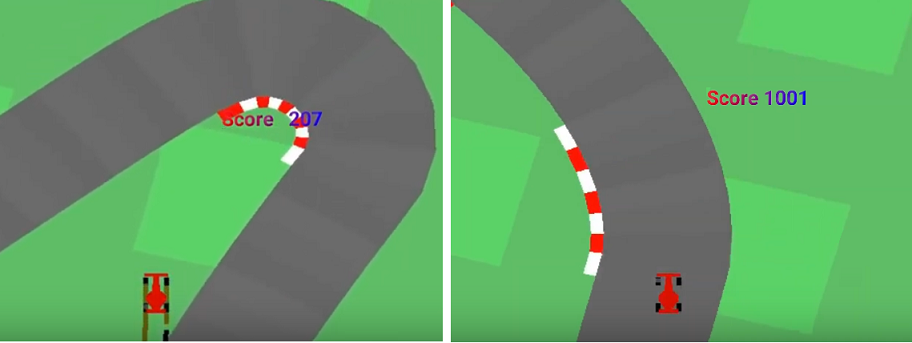

# Project - CarRacing with PPO, Learning from Raw Pixels 

### Introduction

This is the continuous control task learning from pixels, a top-down racing environment. 
State consists of 96x96 pixels. Reward is -0.1 every frame and +1000/N for every track tile visited,    
where N is the total number of tiles in track. For example, if you have finished in 732 frames, 
your reward is 1000 - 0.1\*732 = 926.8 points. The indicators shown at the bottom of the window. 
CarRacing-v0 defines "solving" as getting average reward of 900 over 100 consecutive trials.

  

### Requirement

* [pytorch 0.41](https://pytorch.org/)
* [gym 0.10](https://github.com/openai/gym)

### Environment
The environment is simulated by OpenAI package __gym__ as follows:

      env = gym.make('CarRacing-v0', verbose=0)
      
### Hyperparameters

Agent uses the following hyperparameters:   

_GAMMA=0.99_ # discount, the coefficient related to the _next state_    
_EPOCH= 8_ # the parameter in the update mexanism of the PPO  (beter than 10)   
_MAX_SIZE = 2000_ # the maximal size of the buffer used in the update mechanism   
_BATCH=128_  # optimizer and backward mechisms work after sampling BATCH elements   
_LEARNING_RATE = 0.001_   
_EPS=0.1_ # the clipping parameter using for calculation of the _action loss_    

     surr1 = ratio * advantage
     surr2 = torch.clamp(ratio, 1.0 - EPS, 1.0 + EPS) * advantage
     action_loss = -torch.min(surr1, surr2)

### Neural Network

We use the CNN model with 6 levels Conv2d (torch.nn.Conv2d) and 6 ectified linear units ReLU (torch.nn.ReLU).
The rewards, target and advatage values are calculated by the model:

     target = r + GAMMA * net(next_state)
     advantage = target - net(state)[[1]  ## 1-st return parameter of the forward function
     
### Beta Distribution

The CNN model is used for calculation of parameters __alpha__ and __beta__ of the Beta distribuion.    
The Beta distribution (torch.distributions.beta) is used to fetch the action samples.

     alpha, beta = net(state[index])[0]  ## 0-th return parameter of the forward function
     dist = Beta(alpha, beta)

#### References
Modeling policies as beta distributions was supposed in

"_Improving Stochastic Policy Gradients in Continuous Control with Deep Reinforcement Learning using the Beta Distribution_"
by Po-Wei Chou, Daniel Maturana, Sebastian Scherer, in Proceedings of the 34th International Conference on Machine Learning, PMLR 70:834-843, 2017., http://proceedings.mlr.press/v70/chou17a.html

See also "_Clipped Action Policy Gradient_" by Yasuhiro Fujita, Shin-ichi Maeda, https://arxiv.org/abs/1802.07564

### Update mechanism

Standard policy gradient methods perform one gradient update per data sample.     
In the [original paper](https://arxiv.org/abs/1707.06347) it was proposed a novel objective function that enables **multiple epochs**.   
This is  the **loss** function _L\_t(\\theta)_, which is (approximately) maximized each iteration:    

Parameters **c1**, **c2** and **epoch** are essential hyperparameters in the PPO algorithm.

 
### Training the Agent

We train the agent to understand that it can use information from its surroundings to inform the next best action.
The score **901.81** was achieved in the episode **2760** after training **6 hours 53 minutes**.   

#### Last Episodes
.....     
Ep. 2750, Ep.Timesteps 94, Score: 1006.80, Avg.Score: 893.55, Run.Score 888.10, Time: 06:51:32      
Ep. 2751, Ep.Timesteps 100, Score: 992.34, Avg.Score: 893.43, Run.Score 889.14, Time: 06:51:41     
Ep. 2752, Ep.Timesteps 100, Score: 976.90, Avg.Score: 894.43, Run.Score 890.02, Time: 06:51:51    
Ep. 2753, Ep.Timesteps 100, Score: 871.87, Avg.Score: 894.01, Run.Score 889.84, Time: 06:52:01     
Ep. 2754, Ep.Timesteps 100, Score: 1000.60, Avg.Score: 894.20, Run.Score 890.95, Time: 06:52:10     
Ep. 2755, Ep.Timesteps 100, Score: 992.98, Avg.Score: 895.36, Run.Score 891.97, Time: 06:52:20     
Ep. 2756, Ep.Timesteps 100, Score: 941.98, Avg.Score: 895.57, Run.Score 892.47, Time: 06:52:30     
Ep. 2757, Ep.Timesteps 100, Score: 854.43, Avg.Score: 895.39, Run.Score 892.09, Time: 06:52:40     
Ep. 2758, Ep.Timesteps 100, Score: 989.55, Avg.Score: 895.27, Run.Score 893.06, Time: 06:52:49     
Ep. 2759, Ep.Timesteps 100, Score: 986.25, Avg.Score: 901.81, Run.Score 893.99, Time: 06:52:59    
Solved environment! Running score is 893.99, Avg.Score: 901.81 !    

### Learning from Raw Pixels

* _Move image to DarkGreen_    
Let's see that the triple [0.299, 0.587, 0.114] represents the vector    
'DarkGreen' in the color space. First, let's go to integer gray levels:      
     **[(int)(0.299\*256), (int)(0.587\*256), (int)(0.114\*256)] = [76, 150, 29].**    
Convert this set to hex numbers:   [hex(76), hex(150), hex(29)] = ('0x4c', '0x96', '0x1d')        
In the browser field, we just enter:  color(4d961d), and we get the 'Dark Green'.    

* _Move image to Grayscale_     
We project all pixels (as vectors in the color space) to the DarkGreen vector    
    **v = [0.299, 0.587, 0.114]**.   
For any pixel z = (a,b,c) the project of z on the vector v is 
      pr(z) = (z, v) /|v|.      
Then all pixel values are propotional to  the DarkGreen vector **v**  with the coefficient
**inner vector (z, v)**.       
For example,   
    image.shape = (433, 735, 3)    
    im_dot = np.dot(image, [0.299, 0.587, 0.114])      
    im_dot.shape = (433, 735)         
Function **rgb2gray** returns the image in Graylevels   

    img_gray = rgb2gray(img_rgb)   
    
 * _Stack of 4 frames_      
 State is defined as adjacent 4 frames in shape (4, 96, 96).   
 Four frames are allocated in the function **reset()** (class Wrapper)   
    
     self.stack = [img_gray] * 4   
 At every time step the first frame is discarded and one frame (img_gray) is  
 added to the stack (of 4 frames), see function **step()** (class Wrapper)   
        
     stack.pop(0)      
     stack.append(img_gray)   

### Watch the Trained Agent
 
  The trained weights are daved in the directory **dir_chk**.    
  The car racing trajectory can be replayed by the notebook **WatchAgent**.
  
  I. The weights file  _model_weights_350-550.pth_. Score values are about 350-550.   
  Repalyed 5 episodes are as follows:    
  
Episode 1	Average Score: 63.53,	Score: 63.53 	Time: 00:00:04   
Episode 2	Average Score: 305.90,	Score: 548.28 	Time: 00:00:10    
Episode 3	Average Score: 370.60,	Score: 500.00 	Time: 00:00:11   
Episode 4	Average Score: 366.48,	Score: 354.09 	Time: 00:00:07   
Episode 5	Average Score: 304.39,	Score: 56.03 	Time: 00:00:05  

  II. The weights file _model_weights_480-660.pth_. Score values are about 480-660.  
  Repalyed 5 episodes:     
  
Episode 1	Average Score: 603.72,	Score: 603.72 	Time: 00:00:12    
Episode 2	Average Score: 593.94,	Score: 584.16 	Time: 00:00:11   
Episode 3	Average Score: 432.31,	Score: 109.06 	Time: 00:00:08   
Episode 4	Average Score: 480.99,	Score: 627.01 	Time: 00:00:11   
Episode 5	Average Score: 517.67,	Score: 664.38 	Time: 00:00:11   

  III.  The weights file _model_weights_820-980.pth_. Score values are about 820-980.     
  Repalyed 5 episodes:     
  
Episode 1	Average Score: 1003.80,	Score: 1003.80 	Time: 00:00:10   
Episode 2	Average Score: 958.42,	Score: 913.04 	Time: 00:00:11   
Episode 3	Average Score: 943.30,	Score: 913.04 	Time: 00:00:11   
Episode 4	Average Score: 943.02,	Score: 942.18 	Time: 00:00:11   
Episode 5	Average Score: 938.26,	Score: 919.25 	Time: 00:00:11     

### Video
See video on [youtube](https://www.youtube.com/watch?v=55buBR2pPdc).

### Other PPO projects  
  * [Pong](../Pong-Policy-Gradient-PPO), 8 parallel agents
  * [Crawler](../Project-2_Continuous-Control-Crawler-PPO), 12 parallel agents
  * [BipedalWalker](../BipedalWalker-PPO-VectorizedEnv),   16 parallel agents
  
### Credit

Most of the code is based on the Udacity code for PPO, and the github code of Xiaoteng Ma (https://github.com/xtma/pytorch_car_caring). 

