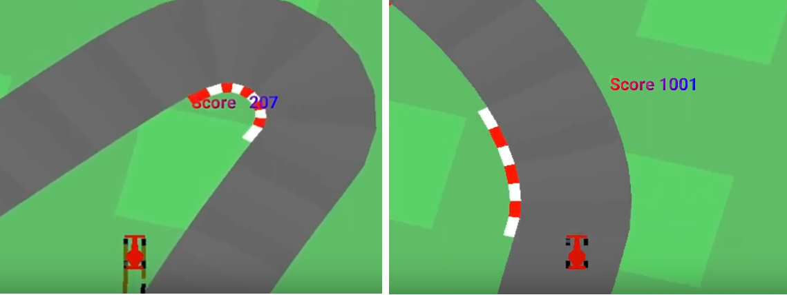

# Project - CarRacing with PPO 

### Introduction

This is the continuous control task learning from pixels, a top-down racing environment. 
State consists of 96x96 pixels. Reward is -0.1 every frame and +1000/N for every track tile visited, 
where N is the total number of tiles in track. For example, if you have finished in 732 frames, 
your reward is 1000 - 0.1\*732 = 926.8 points. The indicators shown at the bottom of the window. 
CarRacing-v0 defines "solving" as getting average reward of 900 over 100 consecutive trials.

