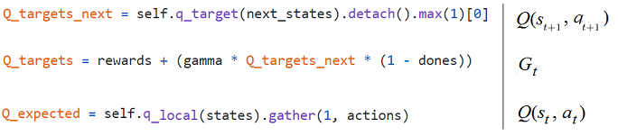
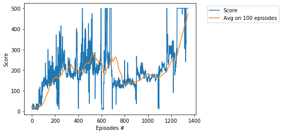

# Project -  Cartpole with Deep Q-Network,  Pytorch

### Environment

Solving the environment require an average total reward of over **195** for _Cartpole-v0_  and **475** for _Cartpole-v1_    
over 100 consecutive episodes. A pole is attached by an joint to a cart, which moves along a track. The system is controlled by applying a force of +1 or -1 to the cart. The pendulum starts upright, and the goal is to prevent it from falling over. A reward of +1 is provided for every timestep that the pole remains upright. The episode ends when the pole > 15 degrees from vertical, or the cart moves > 2.4 units from the center.

## Other CartPole projects

* [CartPole-Policy-Based-Hill-Climbing](https://github.com/Rafael1s/Deep-Reinforcement-Learning-Algorithms/tree/master/CartPole-Policy-Based-Hill-Climbing),  
* [CartPole-Policy-Gradient-Reinforce](https://github.com/Rafael1s/Deep-Reinforcement-Learning-Algorithms/tree/master/CartPole-Policy-Gradient-Reinforce), 
* [Cartpole with Doouble Deep Q-Learning](https://github.com/Rafael1s/Deep-Reinforcement-Learning-Algorithms/tree/master/Cartpole-Double-Deep-Q-Learning)      

### Deep Q-Learning (DQN)   

In _Cartpole_, 2 discrete actions are available:  0 - push cart to the left, 1 - push cart to the right.    

For other DQN projects, see    
[_Navigation_](https://github.com/Rafael1s/Deep-Reinforcement-Learning-Algorithms/tree/master/Project-1_Navigation-DQN), 4 discrete actions are available:     
0 - move forward, 1 - move backward, 2 - turn left, 3 - turn right.    
[_LunarLaunder_](https://github.com/Rafael1s/Deep-Reinforcement-Learning-Algorithms/tree/master/LunarLander-v2-DQN), 4 discrete actions are available:  
 0 - do nothing, 1 - fire left orientation engine, 2 - fire main engine,  3 - fire right orientation engine.   

### Agent   

The class **Agent** is defined in _agent.py_. This is the well-known class implementing 
the following mechanisms:

* Two Q-Networks (local and target) using the simple neural network.
* Replay memory (using the class ReplayBuffer)
* Epsilon-greedy mechanism
* Q-learning, i.e., using the max value for all possible actions
* Computing the loss function by MSE loss
* Minimize the loss by gradient descend mechanism using the ADAM optimizer

### Three important tensors

The Deep Q-Learning agent uses 3 following _tensors_ (see method _learn()_)
constructed on the basis of two _neural networks_ **q_local** and **q_target**:

### Training History

1.  For Cartpole-v0: Score **195** is achieved in **962** episodes   

2.  For Cartpole-v1: Score **475** is achived in **1345** episodes   
     

## Watch the Trained Agent   
For both neural networks, _q_local_ and _q_target_, we save the trained weights into checkpoint files      
with the extension _pth_. The corresponding files are saved into the directory _dir_chk_V0_  for _Cartpole-v0_       
and the directory _dir_chk_V1_ for _Cartpole-v1_. Using notebook **WatchAgent-DQN.ipynb**    
we can load the trained weights and replay them.

### Credit
The following github projects have been used: [pytorch/tutorials](https://github.com/pytorch/tutorials/blob/master/intermediate_source/reinforcement_q_learning.py)  and  [Pocuston/Cartpole-v0](https://gist.github.com/Pocuston/13f1a7786648e1e2ff95bfad02a51521).  

### Paper

[A pair of interrelated neural networks in Deep Q-Network](https://towardsdatascience.com/a-pair-of-interrelated-neural-networks-in-dqn-f0f58e09b3c4)

