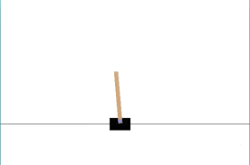
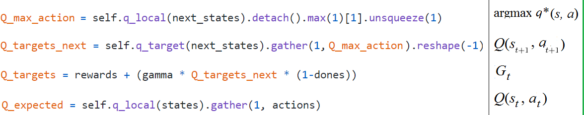
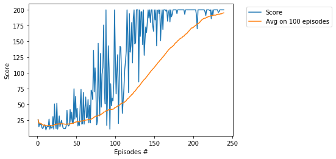
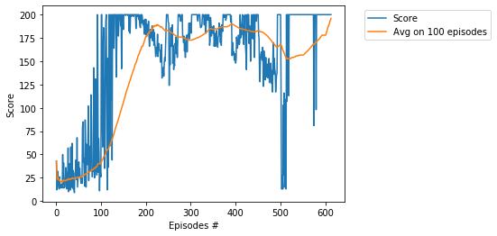
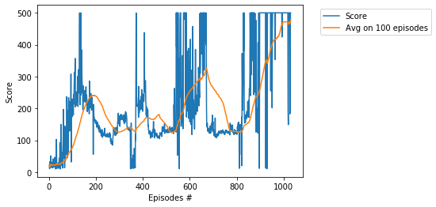

# Project -  Cartpole with Double Deep Q-Network

### Environment

Solving the environment require an average total reward of over **195** for _Cartpole-v0_  and **475** for _Cartpole-v1_      
over 100 consecutive episodes. A pole is attached by an joint to a cart, which moves along a track.    
The system is controlled by applying a force of +1 or -1 to the cart. The pendulum starts upright, and     
the goal is to prevent it from falling over. A reward of +1 is provided for every timestep that the pole remains upright.     
The episode ends when the pole > 15 degrees from vertical, or the cart moves > 2.4 units from the center.  

  

## Other CartPole projects

* [CartPole-Policy-Based-Hill-Climbing](https://github.com/Rafael1s/Deep-Reinforcement-Learning-Algorithms/tree/master/CartPole-Policy-Based-Hill-Climbing), 
*  [CartPole-Policy-Gradient-Reinforce](https://github.com/Rafael1s/Deep-Reinforcement-Learning-Algorithms/tree/master/CartPole-Policy-Gradient-Reinforce),    
* [Cartpole with Deep Q-Learning](https://github.com/Rafael1s/Deep-Reinforcement-Learning-Algorithms/tree/master/Cartpole-Deep-Q-Learning).         
### Four important tensors

The Deep Q-Learning agent uses 4 following _tensors_ (see method _learn()_)
constructed on the basis of two _neural networks_ **q_local** and **q_target**:

### Training History

1.  For Cartpole-v0: Score **195** is achieved in **239** episodes   

2.  For Cartpole-v0: Score **195** is achieved in **612** episodes   

Note that such a quick achievement (239 episodes) of threshold 195       
is a very rare case, the second example (612 episodes) is a much more typical result.    

3.  For Cartpole-v1: Score **475** is achieved in **1030** episodes   
     

### Watch the Trained Agent
For both neural networks, _q_local_ and _q_traget_, we save the trained weights into checkpoint files    
with the extension _pth_. The corresponding files are saved into the directory _dir_chk_V0_ddqn_ for _Cartpole-v0_    
and the directory _dir_chk_V1_ddqn_ for _Cartpole-v1_. Using this notebook we load the trained weights and replay them.  

### Paper

[A pair of interrelated neural networks in Deep Q-Network](https://towardsdatascience.com/a-pair-of-interrelated-neural-networks-in-dqn-f0f58e09b3c4)

