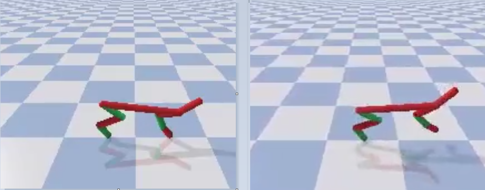
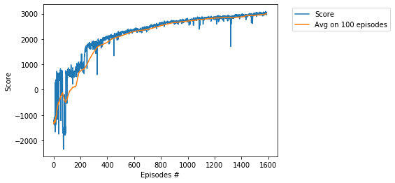

# Project - HalfChhetahBulletEnv with Twin Delayed DDPG (TD3)

### Environment  

Solving the environment require an average total reward of over 3000 over 100 consecutive episodes.    
The environment is solved in __1588 episodes__ in 21 hour 18 min by usage of the __Twin Delayed DDPG (TD3)__ algorithm,    
see the basic paper [Addressing Function Approximation Error in Actor-Critic Methods](https://arxiv.org/abs/1802.09477).    

For __Three TD3 tricks__, see [Walker2DBulletEnv-v0_TD3 Readme](https://github.com/Rafael1s/Deep-Reinforcement-Learning-Algorithms/edit/master/Walker2DBulletEnv-v0_TD3/README.md).

### Exploration noise

Exploration noise is the crucial parameterin in TD3. For this project, the parameter **std_noise** is choosed **0.05**.      
For details, see [Three aspects of Deep RL: noise, overestimation and exploration](https://towardsdatascience.com/three-aspects-of-deep-rl-noise-overestimation-and-exploration-122ffb4bb92b).    

### Training Score

### Credit
