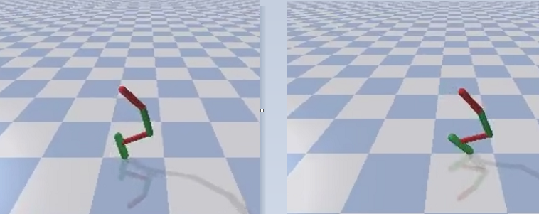
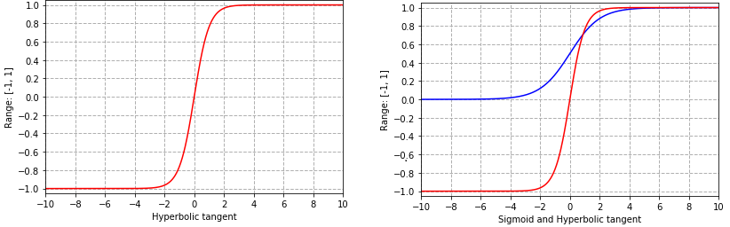
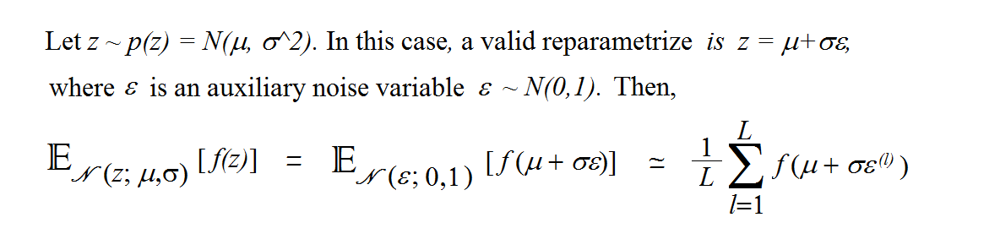
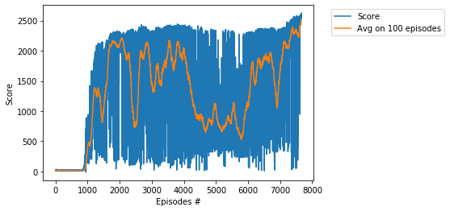
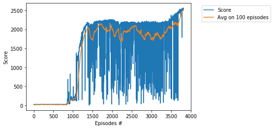

# Project - HopperBulletEnv with Soft Actor-Critic (SAC)

### Environment  

Solving the environment require an average total reward of over **2500** on 100 consecutive episodes.    
Training of HopperBulletEnv is performed using the __Soft Actor-Critic (SAC)__ algorithm, see    
two basic papers [SAC: Off-Policy Maximum Entropy Deep RL with a Stochastic Actor](https://arxiv.org/abs/1801.01290)     
and [SAC Algorithms and Applications](https://arxiv.org/abs/1812.05905). The HopperBulletEnv environment was solved   
in 2 experiments:  (I) in **7662 episodes**,   (II)  in **3814** episodes.     

### Tips to class GaussianPolicy

#### Scale and Bias 

   The varaible _scale_ is the length of the interval [low, high]:     
     _scale = (action_space.high - action_space.low)/2_     
   
   The varaible  _bias_  is the center of  the interval [low, high]:    
    _bias =  (action_space.high + action_space.low)/2_   
    
   These values give the map  [low, high]  --> [(low - bias)/scale, (high - bias)/scale] = [-1,1].  
   
 #### Activation Function
 
 
 
 The **hyperbolic tangent function** torch.tanh is very similar to     
 the [logistic sigmoid function](https://en.wikipedia.org/wiki/Sigmoid_function) g(x) = 1/(1 + exp(-x)).    
 However, the range of _logistic sigmoid function_ is [0,1] and the range of _tanh_ is [-1,1].   
 Then _tanh_ is should be more efficient because it has a wider range, and derivative is more steep,       

    

see [Comparison of Activation Functions for Deep Neural Networks](https://towardsdatascience.com/comparison-of-activation-functions-for-deep-neural-networks-706ac4284c8a). 
 
Actually,  _tanh_ is the rescaled logistic sigmoid function, namely,  _tanh(x) = 2g(2x) - 1_.    
We also note that  _(tanh(x))' = 1 - (tanh(x))^2_.    
            
 
 #### Reparameterization
 
 
 
 see [Auto-Encoding Variational Bayes](https://arxiv.org/abs/1312.6114) by D.Kingma, M.Welling
       

### Training Score

i.  The score 2500 was achieved in the episode **7662** after training **89 hours 23 minutes**.    
Learning rate = **0.0001**.

ii.  The score 2500 was achieved in the episode **3814** after training **37 hours 58 minutes**.    
Here, learning rate = **0.0003**.

### Other Soft Actor-Critic  projects    

* [AntBulletEnv](https://github.com/Rafael1s/Deep-Reinforcement-Learning-Algorithms/tree/master/Ant-PyBulletEnv-Soft-Actor-Critic)    
* [BipedalWalker](https://github.com/Rafael1s/Deep-Reinforcement-Learning-Algorithms/tree/master/BipedalWalker-Soft-Actor-Critic)  
* [MinitaurBulletEnv](https://github.com/Rafael1s/Deep-Reinforcement-Learning-Algorithms/tree/master/Minitaur-Soft-Actor-Critic)    
* [MinitaurBulletDuckEnv](https://github.com/Rafael1s/Deep-Reinforcement-Learning-Algorithms/tree/master/MinitaurDuck-Soft-Actor-Critic)  
* [Walker2dBulletEnv](https://github.com/Rafael1s/Deep-Reinforcement-Learning-Algorithms/tree/master/Walker2DBulletEnv-v0_SAC)   

### The last few lines from the log

...   
Ep.: 3803, Total Steps: 2498568, Ep.Steps: 1000, Score: 2518.460, Avg.Score: 2494.938, Max.Score: 2557.114, Time: 37:48:57     
Ep.: 3804, Total Steps: 2499568, Ep.Steps: 1000, Score: 2522.515, Avg.Score: 2495.311, Max.Score: 2557.114, Time: 37:49:54    
Ep.: 3805, Total Steps: 2500568, Ep.Steps: 1000, Score: 2517.100, Avg.Score: 2495.309, Max.Score: 2557.114, Time: 37:50:52    
Ep.: 3806, Total Steps: 2501568, Ep.Steps: 1000, Score: 2529.950, Avg.Score: 2495.785, Max.Score: 2557.114, Time: 37:51:50     
Ep.: 3807, Total Steps: 2502568, Ep.Steps: 1000, Score: 2544.071, Avg.Score: 2496.402, Max.Score: 2557.114, Time: 37:52:48   
Ep.: 3808, Total Steps: 2503568, Ep.Steps: 1000, Score: 2545.314, Avg.Score: 2496.918, Max.Score: 2557.114, Time: 37:53:45    
Ep.: 3809, Total Steps: 2504568, Ep.Steps: 1000, Score: 2548.591, Avg.Score: 2497.434, Max.Score: 2557.114, Time: 37:54:43    
Ep.: 3810, Total Steps: 2505568, Ep.Steps: 1000, Score: 2543.297, Avg.Score: 2498.089, Max.Score: 2557.114, Time: 37:55:41    
Ep.: 3811, Total Steps: 2506568, Ep.Steps: 1000, Score: 2548.280, Avg.Score: 2498.782, Max.Score: 2557.114, Time: 37:56:39    
Ep.: 3812, Total Steps: 2507568, Ep.Steps: 1000, Score: 2555.617, Avg.Score: 2499.684, Max.Score: 2557.114, Time: 37:57:37    
Ep.: 3813, Total Steps: 2508568, Ep.Steps: 1000, Score: 2562.541, Avg.Score: 2500.254, Max.Score: 2562.541, Time: 37:58:35    
Solved environment with Avg Score:   2500.253525302146   

### Videos
See videos   
[Lucky Hopper](https://www.youtube.com/watch?v=Ipctq89yLB0) and   
[Chessboard chase with four Pybullet actors](https://www.youtube.com/watch?v=NXX4GTim_NM) on youtube.   

### Articles on Soft Actor-Critic

* [Entropy in Soft Actor-Critic (Part 1)](https://towardsdatascience.com/entropy-in-soft-actor-critic-part-1-92c2cd3a3515)   
* [Entropy in Soft Actor-Critic (Part 2)](https://towardsdatascience.com/entropy-in-soft-actor-critic-part-2-59821bdd5671)

### Credit   

Based on Pranjal Tandon's code (https://github.com/pranz24).    

