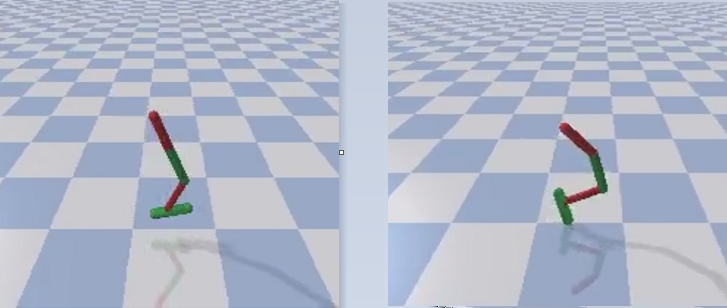
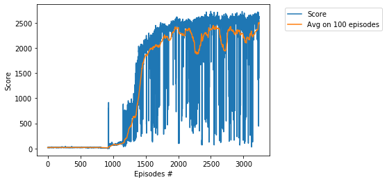
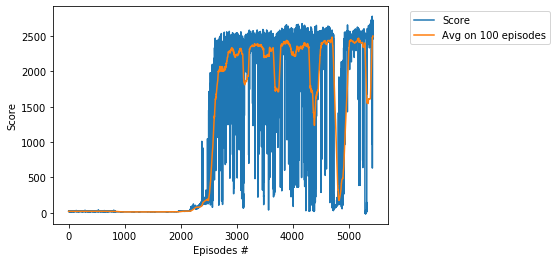

# Project - HopperBulletEnv with Twin Delayed DDPG (TD3)

### Environment  

Solving the environment require an average total reward of over **2500** on 100 consecutive episodes.  
Training of HopperBulletEnv is performed using the __Twin Delayed DDPG (TD3)__ algorithm, see    
the basic paper [Addressing Function Approximation Error in Actor-Critic Methods](https://arxiv.org/abs/1802.09477).    
In this directory we solve the HopperBulletEnv environment in **3240 episodes** with the parameter **noise std = 0.03**,
and in **5438** episodes with **noise std = 0.02**.

### Training the Agent

The score 2500 was achieved in the episode **3240** after training **25 hours 28 minutes**.

The score 2500 was achieved in the episode **5438** after training **36 hours 59 minutes**.

### Relevant paper
[Three aspects of Deep RL: noise, overestimation and exploration](https://towardsdatascience.com/three-aspects-of-deep-rl-noise-overestimation-and-exploration-122ffb4bb92b)   

### Other TD3 projects

* [BipedalWalker](https://github.com/Rafael1s/Deep-Reinforcement-Learning-Algorithms/tree/master/BipedalWalker-TwinDelayed-DDPG%20(TD3))
* [HalfCheetahBulletEnv](https://github.com/Rafael1s/Deep-Reinforcement-Learning-Algorithms/tree/master/HalfCheetahBulletEnv-TD3)
* [MountainCarContinuous](https://github.com/Rafael1s/Deep-Reinforcement-Learning-Algorithms/tree/master/MountainCarContinuous-TD3)   
* [Walker2DBulletEnv](https://github.com/Rafael1s/Deep-Reinforcement-Learning-Algorithms/tree/master/Walker2DBulletEnv-v0_TD3)

### Video
See video [Lucky Hopper](https://www.youtube.com/watch?v=Ipctq89yLB0) on youtube.

### Credit

The source paper is [Addressing Function Approximation Error in Actor-Critic Methods](https://arxiv.org/abs/1802.09477)  
by _Scott Fujimoto_ , _Herke van Hoof_, _David Meger_.

