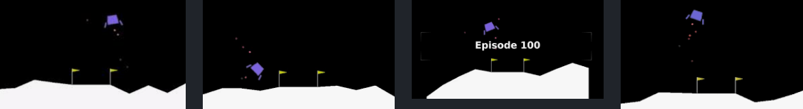
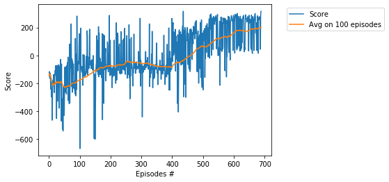

# Project -  LunarLander with DQN

### Environment

Solving the environment require an average total reward of over **200** over 100 consecutive episodes.   
If lander moves away from landing pad it loses reward back. Episode finishes if the lander crashes or   
comes to rest, receiving additional -100 or +100 points. Each leg ground contact is +10. Firing main   
engine is -0.3 points each frame. Firing side engine is -0.03 points each frame.   
Landing outside landing pad is possible. Fuel is infinite, so an agent can learn to fly and then land on   
its first attempt. Four discrete actions available:   
* 0 - do nothing, 
* 1 - fire left orientation engine, direction = -1,
* 2 - fire main engine,   direction = 0,
* 3 - fire right orientation engine, direction = 1

### Deep Q-Network (DQN)

For other DQN projects, see    
[_Navigation_](https://github.com/Rafael1s/Deep-Reinforcement-Learning-Algorithms/tree/master/Project-1_Navigation-DQN), 4 discrete actions are available:     
0 - move forward, 1 - move backward, 2 - turn left, 3 - turn right.    
[_Cartpole_](https://github.com/Rafael1s/Deep-Reinforcement-Learning-Algorithms/edit/master/Cartpole-Deep-Q-Learning), 2 discrete actions are available:  
0 - push cart to the left, 1 - push cart to the right.

### Training  

Score **200** achieved in **688** episodes  

### Scores log

Episode:    10 Score: -464.32665560290786  Avg.Score: -211.87, eps-greedy:  0.80 Time: 00:00:13   
Episode:    20 Score: -111.5535952817493  Avg.Score: -197.04, eps-greedy:  0.60 Time: 00:00:16   
Episode:    30 Score: -222.07050399528984  Avg.Score: -193.53, eps-greedy:  0.41 Time: 00:00:25   
Episode:    40 Score: -61.3325867261642  Avg.Score: -193.07, eps-greedy:  0.21 Time: 00:00:43   
Episode:    50 Score: -178.0840690762476  Avg.Score: -228.92, eps-greedy:  0.01 Time: 00:00:57   
Episode:    60 Score: -231.09562887204956  Avg.Score: -219.88, eps-greedy:  0.01 Time: 00:01:17   
Episode:    70 Score: -88.43051625343654  Avg.Score: -212.66, eps-greedy:  0.01 Time: 00:01:47   
Episode:    80 Score: -235.1281573072673  Avg.Score: -196.37, eps-greedy:  0.01 Time: 00:02:02   
Episode:    90 Score: 282.5547076024702  Avg.Score: -187.02, eps-greedy:  0.01 Time: 00:02:16   
Episode:   100 Score: -667.7644189418329  Avg.Score: -177.35, eps-greedy:  0.01 Time: 00:02:40   
Episode:   110 Score: 7.193894734160935  Avg.Score: -162.43, eps-greedy:  0.01 Time: 00:03:08   
Episode:   120 Score: -6.2490597938852375  Avg.Score: -153.69, eps-greedy:  0.01 Time: 00:03:38   
Episode:   130 Score: -90.9753569204464  Avg.Score: -139.19, eps-greedy:  0.01 Time: 00:04:29   
Episode:   140 Score: -89.46649319877727  Avg.Score: -123.19, eps-greedy:  0.01 Time: 00:05:04   
Episode:   150 Score: -434.99195257029476  Avg.Score: -111.71, eps-greedy:  0.01 Time: 00:05:24   
Episode:   160 Score: 206.84027805298626  Avg.Score: -96.98, eps-greedy:  0.01 Time: 00:05:45   
Episode:   170 Score: -158.34540973580977  Avg.Score: -86.71, eps-greedy:  0.01 Time: 00:05:57   
Episode:   180 Score: -101.77155613519302  Avg.Score: -83.83, eps-greedy:  0.01 Time: 00:06:14   
Episode:   190 Score: 73.12711217151669  Avg.Score: -76.45, eps-greedy:  0.01 Time: 00:06:33   
Episode:   200 Score: -74.79019823113386  Avg.Score: -70.66, eps-greedy:  0.01 Time: 00:06:47   
Episode:   210 Score: -142.25137477660783  Avg.Score: -76.91, eps-greedy:  0.01 Time: 00:07:06   
Episode:   220 Score: 155.02089209916772  Avg.Score: -71.05, eps-greedy:  0.01 Time: 00:07:33   
Episode:   230 Score: -113.30362757545277  Avg.Score: -66.89, eps-greedy:  0.01 Time: 00:07:54   
Episode:   240 Score: -98.47237322321897  Avg.Score: -66.78, eps-greedy:  0.01 Time: 00:08:08   
Episode:   250 Score: -74.87758768943549  Avg.Score: -43.86, eps-greedy:  0.01 Time: 00:08:19   
Episode:   260 Score: -160.56736898865768  Avg.Score: -46.44, eps-greedy:  0.01 Time: 00:08:33   
Episode:   270 Score: -107.55673041017143  Avg.Score: -47.35, eps-greedy:  0.01 Time: 00:08:56   
Episode:   280 Score: -129.23940079520443  Avg.Score: -50.20, eps-greedy:  0.01 Time: 00:09:11   
Episode:   290 Score: 29.041087759355612  Avg.Score: -53.19, eps-greedy:  0.01 Time: 00:09:41   
Episode:   300 Score: -123.55232243891942  Avg.Score: -56.77, eps-greedy:  0.01 Time: 00:10:18   
Episode:   310 Score: -94.29549572707919  Avg.Score: -56.12, eps-greedy:  0.01 Time: 00:10:33    
Episode:   320 Score: -79.52885747424041  Avg.Score: -57.81, eps-greedy:  0.01 Time: 00:10:57    
Episode:   330 Score: -129.34474379787008  Avg.Score: -65.89, eps-greedy:  0.01 Time: 00:11:26   
Episode:   340 Score: -65.04836624484668  Avg.Score: -70.50, eps-greedy:  0.01 Time: 00:11:47    
Episode:   350 Score: -96.21440704967421  Avg.Score: -74.39, eps-greedy:  0.01 Time: 00:12:08   
Episode:   360 Score: -45.945515846050995  Avg.Score: -79.06, eps-greedy:  0.01 Time: 00:12:30   
Episode:   370 Score: -71.52458333631157  Avg.Score: -81.32, eps-greedy:  0.01 Time: 00:12:49   
Episode:   380 Score: -73.891547323811  Avg.Score: -82.37, eps-greedy:  0.01 Time: 00:13:11   
Episode:   390 Score: -125.58766506604762  Avg.Score: -82.00, eps-greedy:  0.01 Time: 00:13:34   
Episode:   400 Score: -43.14455125591614  Avg.Score: -78.59, eps-greedy:  0.01 Time: 00:13:59   
Episode:   410 Score: -112.89178984981118  Avg.Score: -56.44, eps-greedy:  0.01 Time: 00:14:26   
Episode:   420 Score: -123.22997597223707  Avg.Score: -53.47, eps-greedy:  0.01 Time: 00:14:53   
Episode:   430 Score: -17.674071593965937  Avg.Score: -41.19, eps-greedy:  0.01 Time: 00:15:29   
Episode:   440 Score: 200.9508703631388  Avg.Score: -27.63, eps-greedy:  0.01 Time: 00:15:53   
Episode:   450 Score: -64.89948309893549  Avg.Score: -12.11, eps-greedy:  0.01 Time: 00:16:15   
Episode:   460 Score: 191.59929747470179  Avg.Score: 1.83, eps-greedy:  0.01 Time: 00:16:37   
Episode:   470 Score: 153.36695672542496  Avg.Score: 23.06, eps-greedy:  0.01 Time: 00:16:57   
Episode:   480 Score: 129.40440953551982  Avg.Score: 47.76, eps-greedy:  0.01 Time: 00:17:15   
Episode:   490 Score: 235.87429844975682  Avg.Score: 60.09, eps-greedy:  0.01 Time: 00:17:31   
Episode:   500 Score: 145.72787417643744  Avg.Score: 64.02, eps-greedy:  0.01 Time: 00:17:44   
Episode:   510 Score: 21.731489693184358  Avg.Score: 63.18, eps-greedy:  0.01 Time: 00:18:01   
Episode:   520 Score: -19.69740254857139  Avg.Score: 80.35, eps-greedy:  0.01 Time: 00:18:19   
Episode:   530 Score: 268.5323333336088  Avg.Score: 97.34, eps-greedy:  0.01 Time: 00:18:30   
Episode:   540 Score: 266.9270270639854  Avg.Score: 114.55, eps-greedy:  0.01 Time: 00:18:38   
Episode:   550 Score: 24.618978995383515  Avg.Score: 120.96, eps-greedy:  0.01 Time: 00:18:46   
Episode:   560 Score: 271.4809166861627  Avg.Score: 129.79, eps-greedy:  0.01 Time: 00:18:57   
Episode:   570 Score: -110.42080103984318  Avg.Score: 133.75, eps-greedy:  0.01 Time: 00:19:04   
Episode:   580 Score: 212.1556203796742  Avg.Score: 133.56, eps-greedy:  0.01 Time: 00:19:14   
Episode:   590 Score: 255.0787415757521  Avg.Score: 144.09, eps-greedy:  0.01 Time: 00:19:22   
Episode:   600 Score: 270.6213645982825  Avg.Score: 167.10, eps-greedy:  0.01 Time: 00:19:30   
Episode:   610 Score: 301.1184368280439  Avg.Score: 179.35, eps-greedy:  0.01 Time: 00:19:38   
Episode:   620 Score: 281.55753941328317  Avg.Score: 181.18, eps-greedy:  0.01 Time: 00:19:49   
Episode:   630 Score: 272.340680533503  Avg.Score: 178.30, eps-greedy:  0.01 Time: 00:19:55   
Episode:   640 Score: 261.98486893558766  Avg.Score: 173.19, eps-greedy:  0.01 Time: 00:20:02   
Episode:   650 Score: 245.88754825609752  Avg.Score: 181.92, eps-greedy:  0.01 Time: 00:20:13  
Episode:   660 Score: 277.6805610143983  Avg.Score: 186.59, eps-greedy:  0.01 Time: 00:20:19   
Episode:   670 Score: 160.8057728334742  Avg.Score: 194.88, eps-greedy:  0.01 Time: 00:20:30   
Episode:   680 Score: 274.11623504925933  Avg.Score: 194.83, eps-greedy:  0.01 Time: 00:20:42   

### Watch the Trained Agent   
For both neural networks, _q_local_ and _q_traget_, we save the trained weights into checkpoint files    
with the extension _pth_. The corresponding files are saved into the directory _dir_chk_.    
Using notebook **WatchAgent-DQN.ipynb** we can load the trained weights and replay them.

