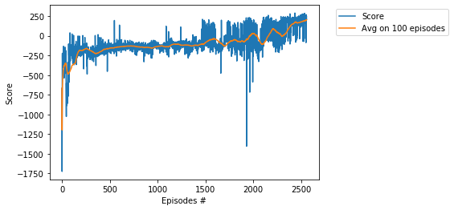
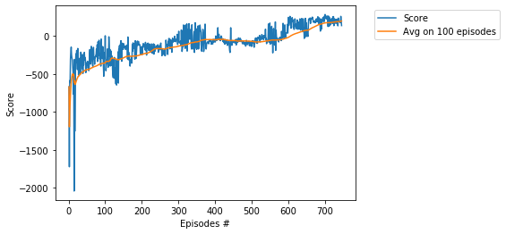

# Project -  LunarLanderContinuous with DDPG

### Environment

Solving the environment require an average total reward of over **200** on 100 consecutive episodes.   
If lander moves away from landing pad it loses reward back. Episode finishes if the lander crashes or   
comes to rest, receiving additional -100 or +100 points. Each leg ground contact is +10. Firing main   
engine is -0.3 points each frame. Firing side engine is -0.03 points each frame.   
Landing outside landing pad is possible. Fuel is infinite, so an agent can learn to fly and then land on   
its first attempt.

### Actions in LunarLanderContinuous   

Any action is the vector of two real numbers **{_v1_, _v2_}**, such that **-1 < _v1_, _v2_ < 1**.    
The first coordinate **_v1_** controls main engine: if **-1 < _v1_ <= 0** the main engine off.     
The values  **0 < _v1_ < 1** are corresponding to the throttle from **50%** to **100%** power, i.e., **power = 50(_v1_+1)**.     
The second coordinate **_v2_** controls left/right engines:        
Values  **-1 < _v2_ <= -0.5** fire the left engine; values  **0.5 <= _v2_ <  1** fire the right engine,    
Values  **-0.5 < _v2_ 0.5** left and right engines off.   

### Deep Deterministic Policy Gradient (DDPG)

The main paper: [_Continuous control with Deep RL_](https://arxiv.org/abs/1509.02971)

For other DDPG project, see [_Reacher_](https://github.com/Rafael1s/Deep-Reinforcement-Learning-Algorithms/tree/master/Project-2_Continuous-Control-Reacher-DDPG).

### Training

1. Score **200** achieved in **2560** episodes.

Learning rate for actor = 1e-3, for critic = 1e-3

2. Score **200** achieved in **746** episodes.

Learning rate for actor = 1e-4, for critic = 1e-3

### Scores log 

Episode 10 Score: -312.26 Average Score: -508.87, Time: 00:00:04 ***    
Episode 20 Score: -231.30 Average Score: -601.98, Time: 00:00:15 ***    
Episode 30 Score: -329.78 Average Score: -512.62, Time: 00:00:22 ***    
Episode 40 Score: -337.07 Average Score: -468.51, Time: 00:00:27 ***    
Episode 50 Score: -349.80 Average Score: -442.29, Time: 00:00:32 ***    
Episode 60 Score: -368.60 Average Score: -426.55, Time: 00:00:37 ***    
Episode 70 Score: -278.15 Average Score: -402.61, Time: 00:00:44 ***    
Episode 80 Score: -74.54 Average Score: -382.30, Time: 00:00:50 ***    
Episode 90 Score: -226.69 Average Score: -362.21, Time: 00:00:58 ***    
Episode 100 Score: 6.01 Average Score: -351.43, Time: 00:01:07 ***    
Episode 110 Score: -7.86 Average Score: -330.51, Time: 00:01:19 ***    
Episode 120 Score: -443.82 Average Score: -289.74, Time: 00:01:34 ***    
Episode 130 Score: -319.18 Average Score: -301.73, Time: 00:01:51 ***    
Episode 140 Score: -303.96 Average Score: -305.58, Time: 00:02:33 ***    
Episode 150 Score: -97.44 Average Score: -285.72, Time: 00:03:54 ***    
Episode 160 Score: -117.09 Average Score: -264.83, Time: 00:05:38 ***    
Episode 170 Score: -354.35 Average Score: -266.59, Time: 00:06:27 ***    
Episode 180 Score: -97.24 Average Score: -260.78, Time: 00:07:22 ***    
Episode 190 Score: -85.98 Average Score: -255.85, Time: 00:08:50 ***    
Episode 200 Score: -147.45 Average Score: -244.19, Time: 00:10:30 ***    
Episode 210 Score: -81.34 Average Score: -228.08, Time: 00:11:55 ***    
Episode 220 Score: -104.57 Average Score: -214.54, Time: 00:13:14 ***    
Episode 230 Score: -150.55 Average Score: -185.53, Time: 00:14:24 ***    
Episode 240 Score: -127.88 Average Score: -163.92, Time: 00:15:10 ***    
Episode 250 Score: -127.98 Average Score: -164.80, Time: 00:15:48 ***    
Episode 260 Score: -230.65 Average Score: -169.41, Time: 00:16:40 ***    
Episode 270 Score: -223.00 Average Score: -158.43, Time: 00:18:03 ***    
Episode 280 Score: -51.84 Average Score: -149.45, Time: 00:19:46 ***    
Episode 290 Score: -0.65 Average Score: -142.04, Time: 00:21:20 ***    
Episode 300 Score: -62.32 Average Score: -133.00, Time: 00:23:07 ***    
Episode 310 Score: -201.72 Average Score: -125.69, Time: 00:24:40 ***    
Episode 320 Score: 146.30 Average Score: -112.32, Time: 00:25:54 ***    
Episode 330 Score: 93.91 Average Score: -95.50, Time: 00:26:57 ***    
Episode 340 Score: -74.23 Average Score: -83.56, Time: 00:28:18 ***    
Episode 350 Score: -174.14 Average Score: -76.51, Time: 00:29:28 ***    
Episode 360 Score: 96.79 Average Score: -58.72, Time: 00:30:47 ***    
Episode 370 Score: -181.15 Average Score: -48.83, Time: 00:32:14 ***    
Episode 380 Score: -76.46 Average Score: -45.70, Time: 00:33:44 ***    
Episode 390 Score: -106.22 Average Score: -45.04, Time: 00:35:38 ***    
Episode 400 Score: -78.96 Average Score: -47.57, Time: 00:37:28 ***    
Episode 410 Score: -4.06 Average Score: -42.25, Time: 00:39:16 ***    
Episode 420 Score: -38.96 Average Score: -43.03, Time: 00:41:01 ***    
Episode 430 Score: -74.10 Average Score: -50.56, Time: 00:42:39 ***    
Episode 440 Score: -185.74 Average Score: -56.40, Time: 00:44:11 ***    
Episode 450 Score: -66.01 Average Score: -56.82, Time: 00:45:45 ***    
Episode 460 Score: -62.71 Average Score: -63.31, Time: 00:47:19 ***    
Episode 470 Score: -38.93 Average Score: -61.19, Time: 00:49:05 ***    
Episode 480 Score: -107.61 Average Score: -62.94, Time: 00:50:46 ***    
Episode 490 Score: -75.93 Average Score: -65.00, Time: 00:52:23 ***    
Episode 500 Score: -136.79 Average Score: -67.67, Time: 00:54:00 ***    
Episode 510 Score: -42.74 Average Score: -75.37, Time: 00:55:39 ***    
Episode 520 Score: -20.05 Average Score: -76.82, Time: 00:57:12 ***    
Episode 530 Score: -19.68 Average Score: -71.73, Time: 00:58:50 ***    
Episode 540 Score: -29.58 Average Score: -62.78, Time: 01:00:31 ***    
Episode 550 Score: 172.62 Average Score: -54.87, Time: 01:02:09 ***    
Episode 560 Score: 101.32 Average Score: -50.07, Time: 01:03:29 ***    
Episode 570 Score: -23.83 Average Score: -49.73, Time: 01:04:57 ***    
Episode 580 Score: -16.09 Average Score: -45.74, Time: 01:06:48 ***    
Episode 590 Score: 140.18 Average Score: -32.83, Time: 01:08:38 ***    
Episode 600 Score: 115.93 Average Score: -16.60, Time: 01:10:24 ***    
Episode 610 Score: 230.58 Average Score: 12.55, Time: 01:11:34 ***    
Episode 620 Score: 129.24 Average Score: 33.46, Time: 01:12:53 ***    
Episode 630 Score: 91.91 Average Score: 49.49, Time: 01:14:19 ***    
Episode 640 Score: 58.73 Average Score: 65.15, Time: 01:15:38 ***    
Episode 650 Score: 176.09 Average Score: 77.29, Time: 01:17:04 ***    
Episode 660 Score: 240.15 Average Score: 93.67, Time: 01:18:21 ***    
Episode 670 Score: 185.35 Average Score: 119.54, Time: 01:19:19 ***    
Episode 680 Score: 210.95 Average Score: 143.62, Time: 01:20:15 ***    
Episode 690 Score: 218.96 Average Score: 160.28, Time: 01:21:15 ***    
Episode 700 Score: 280.84 Average Score: 175.06, Time: 01:22:27 ***    
Episode 710 Score: 266.14 Average Score: 178.35, Time: 01:23:32 ***    
Episode 720 Score: 232.64 Average Score: 181.89, Time: 01:24:34 ***    
Episode 730 Score: 169.02 Average Score: 189.02, Time: 01:25:34 ***    
Episode 740 Score: 191.62 Average Score: 194.17, Time: 01:26:18 ***    
Episode 746 Score: 139.54 Average Score: 200.03, Time: 01:26:49 ***    
Environment solved !   

### Watch the Trained Agent   
For both neural networks, _q_local_ and _q_traget_, we save the trained weights into checkpoint files    
(extension _pth_). The corresponding files are saved into the directory _dir_chk_1_  (case 2560 episodes),   
and _dir_chk_2_ (case 746 episodes). Using notebook **WatchAgent-DDPG.ipynb** we can load the trained weights   
and replay them.    

### Video   
See video [Lunar Armada](https://www.youtube.com/watch?v=6O6g9LCWvIs) on youtube.  

### References   
* [Deep Deterministic Policy Gradient (DDPG): Theory and Implementation](https://towardsdatascience.com/deep-deterministic-policy-gradient-ddpg-theory-and-implementation-747a3010e82f)    
"_Deep Deterministic Policy Gradient (DDPG) is a reinforcement learning technique that combines both Q-learning and Policy gradients._"  

* [Continuous control with deep reinforcement learning](https://arxiv.org/abs/1509.02971)   
"_It is not possible to straightforwardly apply Q-learning to continuous action spaces, because in continuous   
spaces finding the greedy policy requires an optimization of at at every timestep; this optimization  
is too slow to be practical with large, unconstrained function approximators and nontrivial   
action spaces. Instead, here we used an actor-critic approach based on the DPG algorithm (Silver et al., 2014)._   

