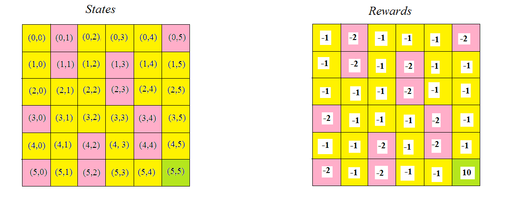
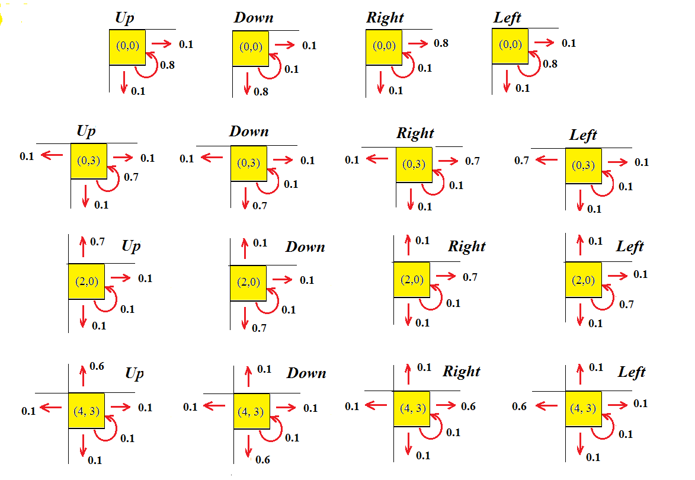
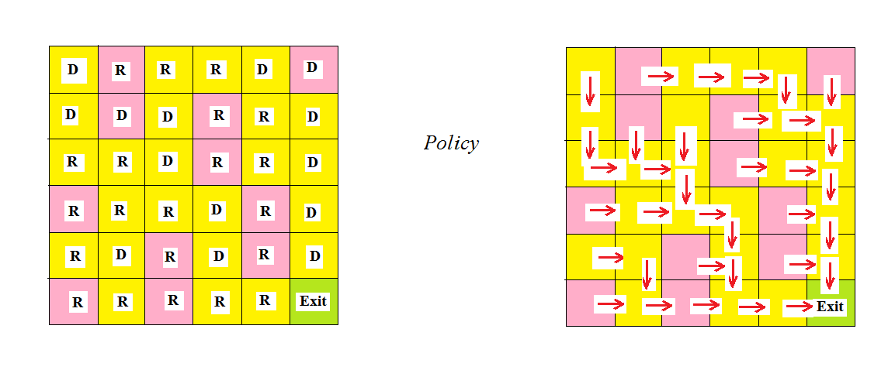

## Environment World

  The environment _state space_ is the gridworld 6x6. The agent learns how to achieve the right down cell (green)      
  from any other cell. In the _rose cells_ (bad cells) the agent gets reward = -2, in the _yellow cells_ (usual cells)   
  the reward = -1,  in the single _green cell_ (**target**)  the reward = 10.
 
  
  
## Actions

**_R_**: (0,1) =  **Right**,   
**_L_**: (0,-1) = **Left**,   
**_U_**: (-1,0) = **Up**,   
**_D_**: (1,0) =  **Down** 

## Transitions

Let the agent be in the cell (0,0), the  left-up cell. If the agent should get the action=**Up**, then he has 10%   
chance of going down, 10% of going left and 80% chance of remaining in place because the agent cannot    
go up from this cell. The same for the action=**Left** because the agent cannot go left from the cell=(0,0).   
Assume the agent is in the cell=(0,3), and the action=**Up**. Then the agent has 10% chance of going down,   
10% of going left, 10% of going right and 70% chance of remaining in place because the agent cannot go up   
from this cell. For the action=**Left** he has 10% chance of going down, of going right, of remaining in place    
and 70% chance of going left. For each action out {**Up**, **Left**, **Right**, **Down**}, the probabilties of going   
to one of 4 cells or of remaining in place are given in the picture below. Here, the transitions rules are   
given almost for any cell. For remaining cells, the transitions rules are similarly given.  

## Examples of transitions

**(1) Just sum = state + actions[action]**   
u_sum = [sum(x) for x in zip(state, actions[action])]  

**(2) State = states[9] = (1 3) + any action**    
Let state = (1 3), then   

(1 3) + Up = (1 3) + (-1 0) = (0 3)  
(1 3) + Right = (1 3) + (0 1) = (1,4)  
(1 3) + Left = (1 3) + (0 -1) = (1 2)   
(1 3) + Down = (1 3) + (1 0) = (2 3)   

**(3) State = states[10] = (1 4) + any action**   

For the state = (1 4), we have   

(1 4) + Up = (1 4) + (-1 0) = (0 4)  
(1 4) + Right = (1 4) + (0 1) = (1 5)  
(1 4) + Left = (1 4) + (0 -1) = (1 3)  
(1 4) + Down = (1 4) + (1 0) = (2 4)   

## Result: Best Policy

key:  (0 0) , best action:  D   
key:  (0 1) , best action:  R   
key:  (0 2) , best action:  R   
key:  (0 3) , best action:  R   
key:  (0 4) , best action:  D   
key:  (0 5) , best action:  D   
key:  (1 0) , best action:  D   
key:  (1 1) , best action:  D   
key:  (1 2) , best action:  D   
key:  (1 3) , best action:  R   
key:  (1 4) , best action:  R      
key:  (1 5) , best action:  D     
key:  (2 0) , best action:  R   
key:  (2 1) , best action:  R   
key:  (2 2) , best action:  D   
key:  (2 3) , best action:  R   
key:  (2 4) , best action:  R   
key:  (2 5) , best action:  D    
key:  (3 0) , best action:  R   
key:  (3 1) , best action:  R   
key:  (3 2) , best action:  R   
key:  (3 3) , best action:  D   
key:  (3 4) , best action:  R    
key:  (3 5) , best action:  D   
key:  (4 0) , best action:  R   
key:  (4 1) , best action:  D   
key:  (4 2) , best action:  R   
key:  (4 3) , best action:  D   
key:  (4 4) , best action:  R   
key:  (4 5) , best action:  D    
key:  (5 0) , best action:  R   
key:  (5 1) , best action:  R   
key:  (5 2) , best action:  R   
key:  (5 3) , best action:  R   
key:  (5 4) , best action:  R   
key:  (5 5) , best action:  EXIT   

## Credit

 Most of the code is based on the webinar code of Willian Paiva.   
 
