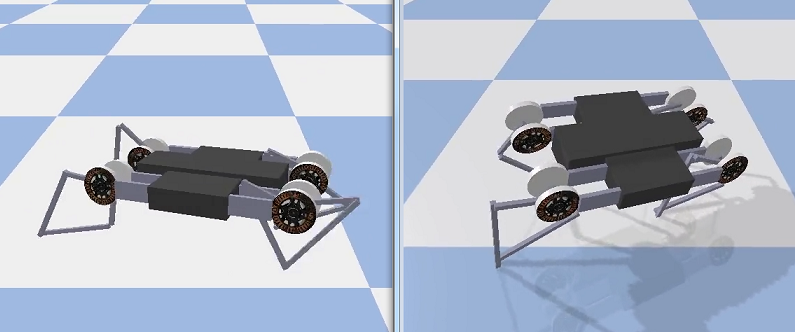
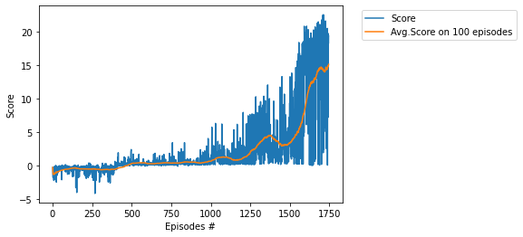
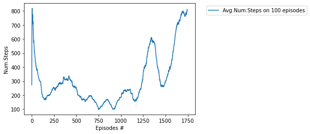
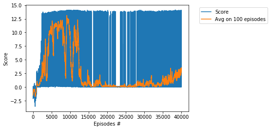
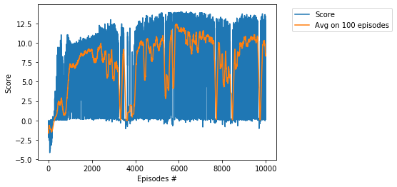

# Project - MinitaurBulletEnv with Soft Actor Critic (SAC)

### Introduction

Solving the environment require an average total reward of over 15.0 over 100 consecutive episodes.      
We solve the MinitaurBulletEnv environment in __1745__ episodes, in __20__ hours, by usage of the __SAC__ algorithm,      
see the basic paper [SAC: Off-Policy Maximum Entropy Deep RL with a Stochastic Actor](https://arxiv.org/abs/1801.01290/).     

### Training Score

### Steps of episodes

Here is a graph of the average number of steps for 100 series.

### Other SAC projects

* [AntBulletEnv](https://github.com/Rafael1s/Deep-Reinforcement-Learning-Algorithms/tree/master/Ant-PyBulletEnv-Soft-Actor-Critic)
* [BipedalWalker](https://github.com/Rafael1s/Deep-Reinforcement-Learning-Algorithms/tree/master/BipedalWalker-Soft-Actor-Critic)
* [HopperBulletEnv](https://github.com/Rafael1s/Deep-Reinforcement-Learning-Algorithms/tree/master/HopperBulletEnv-v0-SAC)
* [MinitaurBulletDuckEnv](https://github.com/Rafael1s/Deep-Reinforcement-Learning-Algorithms/tree/master/MinitaurDuck-Soft-Actor-Critic)  
* [Walker2dBulletEnv](https://github.com/Rafael1s/Deep-Reinforcement-Learning-Algorithms/tree/master/Walker2DBulletEnv-v0_SAC)

### The last few lines from the log

...     
Ep.: 1670, Tot.St.: 489093, Avg.Num.St.: 753.8, Min-Max.Sc.: (0.04, 20.80), Avg.Score: 13.621, Time: 17:11:46    
Ep.: 1680, Tot.St.: 497313, Avg.Num.St.: 776.1, Min-Max.Sc.: (0.04, 21.44), Avg.Score: 14.260, Time: 17:35:09    
Ep.: 1690, Tot.St.: 505945, Avg.Num.St.: 791.1, Min-Max.Sc.: (0.04, 21.44), Avg.Score: 14.479, Time: 17:59:44    
Ep.: 1700, Tot.St.: 514981, Avg.Num.St.: 789.7, Min-Max.Sc.: (0.04, 21.44), Avg.Score: 14.473, Time: 18:25:31    
Ep.: 1710, Tot.St.: 522821, Avg.Num.St.: 774.7, Min-Max.Sc.: (0.04, 22.46), Avg.Score: 14.205, Time: 18:47:56    
Ep.: 1720, Tot.St.: 530160, Avg.Num.St.: 760.6, Min-Max.Sc.: (0.04, 22.51), Avg.Score: 14.020, Time: 19:09:32    
Ep.: 1730, Tot.St.: 538166, Avg.Num.St.: 778.1, Min-Max.Sc.: (0.04, 22.51), Avg.Score: 14.498, Time: 19:33:12    
Ep.: 1740, Tot.St.: 545961, Avg.Num.St.: 800.1, Min-Max.Sc.: (0.04, 22.51), Avg.Score: 14.872, Time: 19:56:14   
Solved environment with Avg Score:   15.097705826385656    

Full log is available in the  [jupyter notebook file](https://github.com/Rafael1s/Deep-Reinforcement-Learning-Algorithms/blob/master/Minitaur-Soft-Actor-Critic/Minitaur-SAC_lr0.0001-b128-1745ep.ipynb).     

### Trials not reaching the threshold 

lr = 0.0001,  
batch size = 512,    
10000 episodes,   
maximal vaue for average score = __13.85__     
     

lr = 0.00001,   
batch size = 128,   
40000 episodes,   
maximal vaue for average score = __13.09__     
   

lr = 0.0001    
batch size = 1024    
10000 episodes    
maximal vaue for average score = __12.41__    
     

### Video  

See video [Four stages of Minitaur training](https://www.youtube.com/watch?v=uEAqyEwvi54) on youtube.

### Real Minitaur   

Learning to Walk via Deep Reinforcement Learning, [Minitaur-Locomotion](https://sites.google.com/view/minitaur-locomotion/).

### Credit       

The implementation of the SAC algorithm is based on Pranjal Tandon's code (https://github.com/pranz24).   

