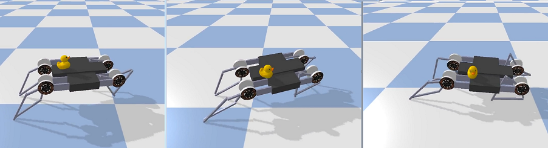

# Project - MinitaurBulletDuckEnv with Soft Actor Critic (SAC)

### Introduction

Solving the environment require an average total reward of over __5.0__ over 100 consecutive episodes.        
We solve the MinitaurBulletEnv environment in __12888__ episodes, in __75__ hours, by usage of the __SAC__ algorithm,      
see the basic paper [SAC: Off-Policy Maximum Entropy Deep RL with a Stochastic Actor](https://arxiv.org/abs/1801.01290/).  

### Training Score   

### Steps of episodes

Here is a graph of the average number of steps for 100 series.

### Other SAC projects

* [AntBulletEnv](https://github.com/Rafael1s/Deep-Reinforcement-Learning-Algorithms/tree/master/Ant-PyBulletEnv-Soft-Actor-Critic)   
* [BipedalWalker](https://github.com/Rafael1s/Deep-Reinforcement-Learning-Algorithms/tree/master/BipedalWalker-Soft-Actor-Critic)   
* [HopperBulletEnv](https://github.com/Rafael1s/Deep-Reinforcement-Learning-Algorithms/tree/master/HopperBulletEnv-v0-SAC)   
* [MinitaurBulletEnv](https://github.com/Rafael1s/Deep-Reinforcement-Learning-Algorithms/tree/master/Minitaur-Soft-Actor-Critic)  
* [Walker2dBulletEnv](https://github.com/Rafael1s/Deep-Reinforcement-Learning-Algorithms/tree/master/Walker2DBulletEnv-v0_SAC)   
