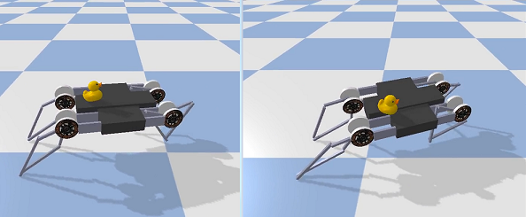
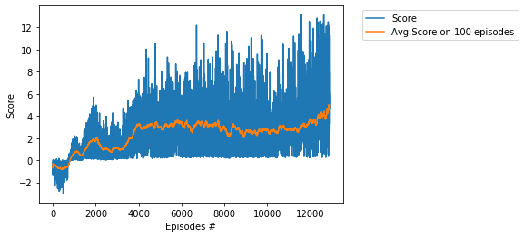
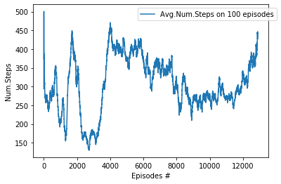
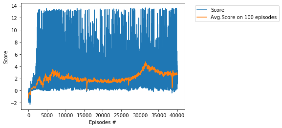
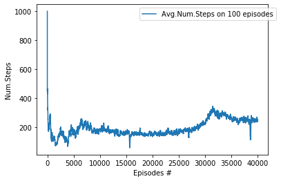

# Project - MinitaurBulletDuckEnv with Soft Actor Critic (SAC)

### Introduction

Solving the environment require an average total reward of over __5.0__ over 100 consecutive episodes.        
We solve the MinitaurBulletEnv environment in __12888__ episodes, in __75__ hours, by usage of the __SAC__ algorithm,      
see the basic paper [SAC: Off-Policy Maximum Entropy Deep RL with a Stochastic Actor](https://arxiv.org/abs/1801.01290/).    

### Training Score   

### Steps of episodes

Here is the graph of the average number of steps for 100 series.

### The last few lines from the log

...     
Ep.: 12780, Tot.St.: 3899776, Avg.Num.St.: 402.1, Min-Max.Sc.: (0.26, 12.11), Avg.Score: 4.503, Time: 74:22:39   
Ep.: 12790, Tot.St.: 3903794, Avg.Num.St.: 413.3, Min-Max.Sc.: (0.26, 12.11), Avg.Score: 4.695, Time: 74:28:13   
Ep.: 12800, Tot.St.: 3906399, Avg.Num.St.: 401.2, Min-Max.Sc.: (0.26, 12.11), Avg.Score: 4.539, Time: 74:31:50   
Ep.: 12810, Tot.St.: 3909642, Avg.Num.St.: 397.4, Min-Max.Sc.: (0.26, 12.11), Avg.Score: 4.451, Time: 74:36:19   
Ep.: 12820, Tot.St.: 3912919, Avg.Num.St.: 384.0, Min-Max.Sc.: (0.26, 12.11), Avg.Score: 4.304, Time: 74:40:52   
Ep.: 12830, Tot.St.: 3917483, Avg.Num.St.: 384.9, Min-Max.Sc.: (1.18, 12.11), Avg.Score: 4.351, Time: 74:47:11    
Ep.: 12840, Tot.St.: 3921720, Avg.Num.St.: 395.2, Min-Max.Sc.: (1.18, 12.11), Avg.Score: 4.434, Time: 74:53:04   
Ep.: 12850, Tot.St.: 3927608, Avg.Num.St.: 413.8, Min-Max.Sc.: (0.56, 12.51), Avg.Score: 4.612, Time: 75:01:13    
Ep.: 12860, Tot.St.: 3933131, Avg.Num.St.: 415.6, Min-Max.Sc.: (0.34, 12.51), Avg.Score: 4.642, Time: 75:08:51   
Ep.: 12870, Tot.St.: 3938640, Avg.Num.St.: 438.9, Min-Max.Sc.: (0.34, 12.51), Avg.Score: 4.924, Time: 75:16:29   
Ep.: 12880, Tot.St.: 3942984, Avg.Num.St.: 432.1, Min-Max.Sc.: (0.34, 12.51), Avg.Score: 4.845, Time: 75:22:32   
Solved environment with Avg Score:   5.023    

### Trials not reaching the threshold   

lr = 0.0005,   
batch size = 128,   
40000 episodes,   
maximal vaue for average score = 2.6,   
   

The graph of the average number of steps for 100 series.   
   

### Other SAC projects

* [AntBulletEnv](https://github.com/Rafael1s/Deep-Reinforcement-Learning-Algorithms/tree/master/Ant-PyBulletEnv-Soft-Actor-Critic)   
* [BipedalWalker](https://github.com/Rafael1s/Deep-Reinforcement-Learning-Algorithms/tree/master/BipedalWalker-Soft-Actor-Critic)   
* [HopperBulletEnv](https://github.com/Rafael1s/Deep-Reinforcement-Learning-Algorithms/tree/master/HopperBulletEnv-v0-SAC)   
* [MinitaurBulletEnv](https://github.com/Rafael1s/Deep-Reinforcement-Learning-Algorithms/tree/master/Minitaur-Soft-Actor-Critic)  
* [Walker2dBulletEnv](https://github.com/Rafael1s/Deep-Reinforcement-Learning-Algorithms/tree/master/Walker2DBulletEnv-v0_SAC) 

### Video

See video [You can sleep while I drive, Minitaur with Duck](https://www.youtube.com/watch?v=_7_Rke5R3JQ) on youtube.   

### Credit   

Based on Pranjal Tandon's code (https://github.com/pranz24).

