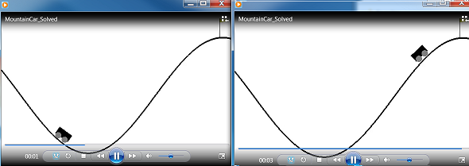
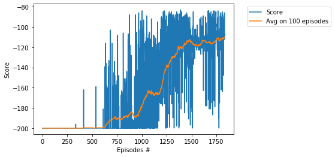

# Project - MountainCar with DQN

### Environment   

Solving the environment require an average total reward of over -110 on 100 consecutive episodes.     
Training of MountainCar is performed using the __Deep Q-Network (DQN)__ algorithm, see    
the basic paper [Human-level control through deep reinforcement learning](https://deepmind.com/research/publications/human-level-control-through-deep-reinforcement-learning).   
We solve the MountainCar environment in **1835 episodes**, in __1.75__ hours.   
By usage of the Q-learning algorithm, the environment is solved in **283600** episodes in __22 minutes__!   

### Training Score

### The last few lines from the log

...   
Episode:  1720 Score: -104.0  Avg.Score: -115.19, eps-greedy: 0.010 Time: 01:38:00     
Episode:  1730 Score: -112.0  Avg.Score: -115.08, eps-greedy: 0.010 Time: 01:38:17   
Episode:  1740 Score: -109.0  Avg.Score: -114.50, eps-greedy: 0.010 Time: 01:38:34   
Episode:  1750 Score: -104.0  Avg.Score: -112.74, eps-greedy: 0.010 Time: 01:38:50   
Episode:  1760 Score: -91.0  Avg.Score: -111.35, eps-greedy: 0.010 Time: 01:39:06    
Episode:  1770 Score: -104.0  Avg.Score: -110.76, eps-greedy: 0.010 Time: 01:39:22   
Episode:  1780 Score: -107.0  Avg.Score: -112.90, eps-greedy: 0.010 Time: 01:39:44   
Episode:  1790 Score: -104.0  Avg.Score: -112.66, eps-greedy: 0.010 Time: 01:40:01   
Episode:  1800 Score: -105.0  Avg.Score: -111.67, eps-greedy: 0.010 Time: 01:40:19   
Episode:  1810 Score: -164.0  Avg.Score: -111.84, eps-greedy: 0.010 Time: 01:40:35    
Episode:  1820 Score: -107.0  Avg.Score: -110.90, eps-greedy: 0.010 Time: 01:40:50   
Episode:  1830 Score: -86.0  Avg.Score: -110.42, eps-greedy: 0.010 Time: 01:41:07   

 Environment solved in 1834 episodes!	Average Score: -109.95    
 
 ### MountainCar, different models

* [MountainCar, Q-learning](https://github.com/Rafael1s/Deep-Reinforcement-Learning-Algorithms/tree/master/MountainCar-Q-Learning)
* [MountainCarContinuous, PPO](https://github.com/Rafael1s/Deep-Reinforcement-Learning-Algorithms/tree/master/MountainCarContinuous_PPO) 
* [MountainCarContinuous, TD3](https://github.com/Rafael1s/Deep-Reinforcement-Learning-Algorithms/edit/master/MountainCarContinuous-TD3) 
 
### Other DQN projects

* [Navigation](https://github.com/Rafael1s/Deep-Reinforcement-Learning-Algorithms/tree/master/Project-1_Navigation-DQN)   
* [LunarLaunder](https://github.com/Rafael1s/Deep-Reinforcement-Learning-Algorithms/tree/master/LunarLander-v2-DQN)    
* [CartPole](https://github.com/Rafael1s/Deep-Reinforcement-Learning-Algorithms/tree/master/Cartpole-Deep-Q-Learning)     
* [Snake-Pygame](https://github.com/Rafael1s/Deep-Reinforcement-Learning-Algorithms/tree/master/Snake-Pygame-DQN)   

