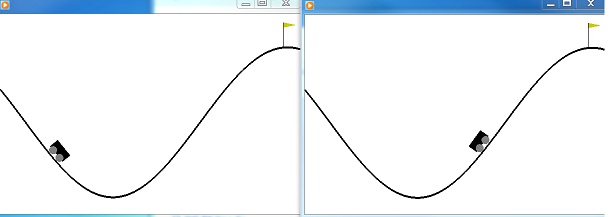
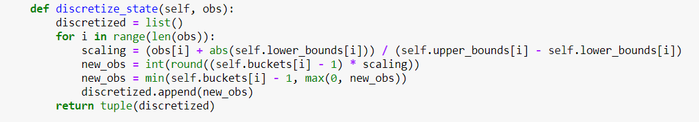
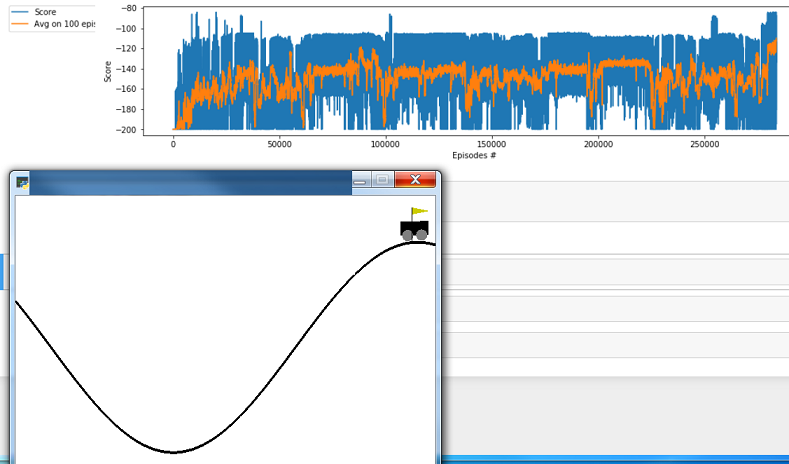

# Project - MountainCar with Q-learning   
    
Mountain Car, is a problem in which an under-powered car must drive up a steep hill.   
    

Since gravity is stronger than the car's engine, even at full throttle,    
the car cannot simply accelerate up the steep slope. The car is situated in a valley    
and must learn to leverage potential energy by driving up the opposite hill     
before the car is able to make it to the goal at the top of the rightmost hill.   
The domain has been used as a test bed in various Reinforcement Learning papers.   

### State and action spaces

The states are the position of the car in the horizontal axis on the range [-1.2, 0.6]      
and its velocity on the range [-0.07, 0.07]. The goal is to get the car to accelerate    
up the hill and get to the flag.  The possible actions are __(left, neutral, right)__.   
Thus, we have the two-dimensional continuous __state space__   [position x velocity].   
and one-dimensional discrete __action space__ with values (0,1,2).    

### Environment and reward threshold

Solving the environment require an average total reward of over __-110__ on 100 consecutive episodes.    
By using the __Q-learning__ algorithm we solve __MountainCar-v0__ environment in **283600 episodes**   
in **22 minutes !**.   

_Note that Q-learning is the core of the DQN (Deep Q-Network) algoritm, but it is not Deep Learning,   
since we do not use neural networks!_

### Discretization

The state space [position x velocity] is discretized into __12x12__  buckets.

### Training Score

### The last few lines from the log
...      
Episode: 278400, Timesteps:  114, Score: -114.0,  Avg.Score: -138.80, eps-greedy:  0.01, Time: 00:21:46    
Episode: 278800, Timesteps:  160, Score: -160.0,  Avg.Score: -145.13, eps-greedy:  0.01, Time: 00:21:48    
Episode: 279200, Timesteps:  101, Score: -101.0,  Avg.Score: -136.76, eps-greedy:  0.01, Time: 00:21:50     
Episode: 279600, Timesteps:  148, Score: -148.0,  Avg.Score: -128.03, eps-greedy:  0.01, Time: 00:21:52     
Episode: 280000, Timesteps:  174, Score: -174.0,  Avg.Score: -122.91, eps-greedy:  0.01, Time: 00:21:54    
Episode: 280400, Timesteps:  107, Score: -107.0,  Avg.Score: -121.37, eps-greedy:  0.01, Time: 00:21:55    
Episode: 280800, Timesteps:  114, Score: -114.0,  Avg.Score: -119.33, eps-greedy:  0.01, Time: 00:21:57    
Episode: 281200, Timesteps:  135, Score: -135.0,  Avg.Score: -120.35, eps-greedy:  0.01, Time: 00:21:59    
Episode: 281600, Timesteps:  116, Score: -116.0,  Avg.Score: -122.64, eps-greedy:  0.01, Time: 00:22:00    
Episode: 282000, Timesteps:  97, Score: -97.0,  Avg.Score: -116.98, eps-greedy:  0.01, Time: 00:22:02    
Episode: 282400, Timesteps:  89, Score: -89.0,  Avg.Score: -121.86, eps-greedy:  0.01, Time: 00:22:04    
Episode: 282800, Timesteps:  113, Score: -113.0,  Avg.Score: -119.09, eps-greedy:  0.01, Time: 00:22:05   
Episode: 283200, Timesteps:  85, Score: -85.0,  Avg.Score: -115.96, eps-greedy:  0.01, Time: 00:22:07    
Episode: 283600, Timesteps:  114, Score: -114.0,  Avg.Score: -109.86, eps-greedy:  0.01, Time: 00:22:08   

### MountainCar, different models

* [MountainCar, DQN](https://github.com/Rafael1s/Deep-Reinforcement-Learning-Algorithms/tree/master/MountainCar-DQN)
* [MountainCarContinuous, PPO](https://github.com/Rafael1s/Deep-Reinforcement-Learning-Algorithms/tree/master/MountainCarContinuous_PPO) 
* [MountainCarContinuous, TD3](https://github.com/Rafael1s/Deep-Reinforcement-Learning-Algorithms/edit/master/MountainCarContinuous-TD3)

### Credit   

The notebook code is based on Isaac Patole's implementation (https://github.com/IsaacPatole/Mountaincar-v0-using-Q-learning/blob/master/Qlearning_for_Mountaincar.py).   

