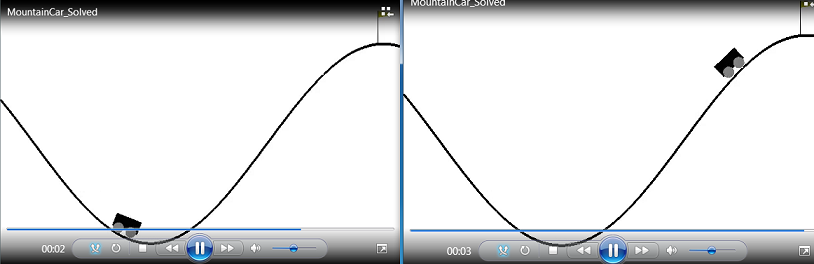
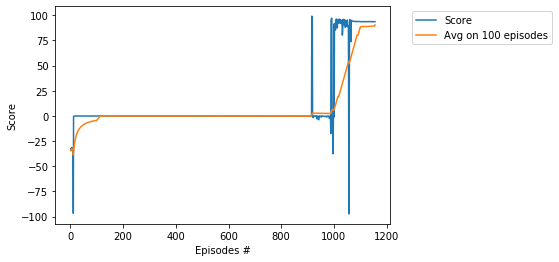

# Project - MountainCarContinuous with Twin Delayed DDPG (TD3)    

### Environment  

Solving the environment require an average total reward of over __90__ over 100 consecutive episodes.    
The environment is solved in __1156 episodes__ in __10 hours__ by usage of the __Twin Delayed DDPG (TD3)__ algorithm,    
see the basic paper [Addressing Function Approximation Error in Actor-Critic Methods](https://arxiv.org/abs/1802.09477).

### Training Score

### The last few lines from the log

...   
Ep. 1030, Timestep 1004825,  Ep.Timesteps 142, Score: 91.24, Avg.Score: 30.508, Max.Score: 97.22,  Time: 10:07:00   
Ep. 1040, Timestep 1006588,  Ep.Timesteps 202, Score: 90.12, Avg.Score: 39.671, Max.Score: 97.22,  Time: 10:08:04    
Ep. 1050, Timestep 1008313,  Ep.Timesteps 168, Score: 88.94, Avg.Score: 48.995, Max.Score: 97.22,  Time: 10:09:09    
Ep. 1060, Timestep 1012219,  Ep.Timesteps 82, Score: 95.83, Avg.Score: 54.175, Max.Score: 97.22,  Time: 10:11:34    
Ep. 1070, Timestep 1013645,  Ep.Timesteps 67, Score: 94.19, Avg.Score: 63.350, Max.Score: 97.22,  Time: 10:12:27    
Ep. 1080, Timestep 1014330,  Ep.Timesteps 72, Score: 93.80, Avg.Score: 72.792, Max.Score: 97.22,  Time: 10:12:51    
Ep. 1090, Timestep 1015009,  Ep.Timesteps 68, Score: 93.79, Avg.Score: 80.504, Max.Score: 97.22,  Time: 10:13:16    
Ep. 1100, Timestep 1015683,  Ep.Timesteps 67, Score: 93.73, Avg.Score: 87.611, Max.Score: 96.26,  Time: 10:13:41    
Ep. 1110, Timestep 1016360,  Ep.Timesteps 70, Score: 93.55, Avg.Score: 88.831, Max.Score: 96.26,  Time: 10:14:05    
Ep. 1120, Timestep 1017028,  Ep.Timesteps 66, Score: 93.75, Avg.Score: 88.867, Max.Score: 95.93,  Time: 10:14:30    
Ep. 1130, Timestep 1017700,  Ep.Timesteps 68, Score: 93.64, Avg.Score: 88.817, Max.Score: 95.93,  Time: 10:14:55       
Ep. 1140, Timestep 1018362,  Ep.Timesteps 65, Score: 93.77, Avg.Score: 89.098, Max.Score: 95.83,  Time: 10:15:20    
Ep. 1150, Timestep 1019031,  Ep.Timesteps 68, Score: 93.64, Avg.Score: 89.277, Max.Score: 95.83,  Time: 10:15:44    
Ep. 1156, Timestep 1019431,  Ep.Timesteps 66, Score: 93.68, Avg.Score: 90.408, Max.Score: 95.83,  Time: 10:15:59    
Environment solved with Average Score:  90.40762049331501   

### MountainCar, different models

* [MountainCar, Q-learning](https://github.com/Rafael1s/Deep-Reinforcement-Learning-Algorithms/tree/master/MountainCar-Q-Learning)
* [MountainCar, DQN](https://github.com/Rafael1s/Deep-Reinforcement-Learning-Algorithms/tree/master/MountainCar-DQN)
* [MountainCarContinuous, PPO](https://github.com/Rafael1s/Deep-Reinforcement-Learning-Algorithms/tree/master/MountainCarContinuous_PPO) 

### Other TD3 projects

* [BipedalWalker](https://github.com/Rafael1s/Deep-Reinforcement-Learning-Algorithms/tree/master/BipedalWalker-TwinDelayed-DDPG%20(TD3))  
* [HalfCheetahBulletEnv](https://github.com/Rafael1s/Deep-Reinforcement-Learning-Algorithms/tree/master/HalfCheetahBulletEnv-TD3)   
* [HopperBulletEnv](https://github.com/Rafael1s/Deep-Reinforcement-Learning-Algorithms/tree/master/HopperBulletEnv_v0-TD3)   
* [Walker2DBulletEnv](https://github.com/Rafael1s/Deep-Reinforcement-Learning-Algorithms/tree/master/Walker2DBulletEnv-v0_TD3)   

