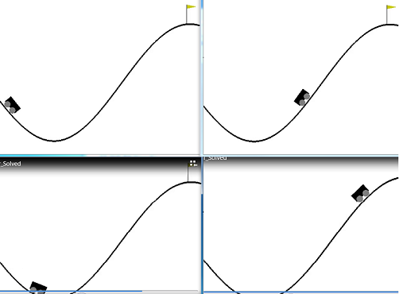
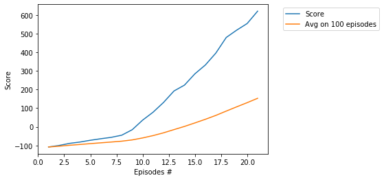

## Project - MountainCarContinuous with PPO (vectorized environments)

###  Environment   
Usually, solving the environment require an average total reward of over the threshold over 100 consecutive episodes.      
However, in this case the solution is achieved very fastly: in __21 episodes__ in __1 minute__ !  This is due to the fact    
that there are 16 processes in use in this PPO implementation notebook. We can think that the real number of episodes    
is __21x16 = 336__.   

We use PPO with vectorized environments, the basic paper: [Proximal Policy Optimization Algorithms](https://arxiv.org/abs/1707.06347).    
**Vectorized Environments** (in our case there are  16 environments) is a method that means that the agent is trained in     
16 environments simultaneously.

### Training score

## Log

Ep. 1, Timesteps 999, Score.Agents: -100.28, Avg.Score: -104.26, Time: 00:00:07, Interval: 00:07   
Ep. 2, Timesteps 999, Score.Agents: -89.06, Avg.Score: -99.19, Time: 00:00:11, Interval: 00:04   
Ep. 3, Timesteps 999, Score.Agents: -81.92, Avg.Score: -94.87, Time: 00:00:15, Interval: 00:04   
Ep. 4, Timesteps 999, Score.Agents: -72.26, Avg.Score: -90.35, Time: 00:00:19, Interval: 00:04   
Ep. 5, Timesteps 999, Score.Agents: -64.13, Avg.Score: -85.98, Time: 00:00:23, Interval: 00:04    
Ep. 6, Timesteps 999, Score.Agents: -56.60, Avg.Score: -81.78, Time: 00:00:27, Interval: 00:04    
Ep. 7, Timesteps 999, Score.Agents: -45.15, Avg.Score: -77.21, Time: 00:00:31, Interval: 00:04   
Ep. 8, Timesteps 999, Score.Agents: -15.89, Avg.Score: -70.39, Time: 00:00:35, Interval: 00:04    
Ep. 9, Timesteps 999, Score.Agents: 35.67, Avg.Score: -59.79, Time: 00:00:39, Interval: 00:04    
Ep. 10, Timesteps 999, Score.Agents: 78.21, Avg.Score: -47.24, Time: 00:00:42, Interval: 00:03   
Ep. 11, Timesteps 999, Score.Agents: 130.52, Avg.Score: -32.43, Time: 00:00:46, Interval: 00:04   
Ep. 12, Timesteps 999, Score.Agents: 191.98, Avg.Score: -15.17, Time: 00:00:50, Interval: 00:04   
Ep. 13, Timesteps 999, Score.Agents: 223.33, Avg.Score: 1.87, Time: 00:00:54, Interval: 00:04    
Ep. 14, Timesteps 999, Score.Agents: 284.03, Avg.Score: 20.68, Time: 00:00:58, Interval: 00:04   
Ep. 15, Timesteps 999, Score.Agents: 331.33, Avg.Score: 40.10, Time: 00:01:02, Interval: 00:04   
Ep. 16, Timesteps 999, Score.Agents: 394.99, Avg.Score: 60.97, Time: 00:01:06, Interval: 00:04   
Ep. 17, Timesteps 999, Score.Agents: 479.05, Avg.Score: 84.20, Time: 00:01:10, Interval: 00:04   
Ep. 18, Timesteps 999, Score.Agents: 518.25, Avg.Score: 107.04, Time: 00:01:14, Interval: 00:04   
Ep. 19, Timesteps 999, Score.Agents: 553.75, Avg.Score: 129.38, Time: 00:01:18, Interval: 00:04   
Ep. 20, Timesteps 999, Score.Agents: 619.99, Avg.Score: 152.74, Time: 00:01:22, Interval: 00:04  
Environment solved with Average Score:  152.7411231610043    

### MountainCar, different models

* [MountainCar, Q-learning](https://github.com/Rafael1s/Deep-Reinforcement-Learning-Algorithms/tree/master/MountainCar-Q-Learning)
* [MountainCar, DQN](https://github.com/Rafael1s/Deep-Reinforcement-Learning-Algorithms/tree/master/MountainCar-DQN)
* [MountainCarContinuous, TD3](https://github.com/Rafael1s/Deep-Reinforcement-Learning-Algorithms/tree/master/MountainCarContinuous-TD3) 

### Other PPO projects

  * [BipedalWalker](https://github.com/Rafael1s/Deep-Reinforcement-Learning-Algorithms/tree/master//BipedalWalker-PPO-VectorizedEnv),   16 parallel agents 
  * [CarRacing](https://github.com/Rafael1s/Deep-Reinforcement-Learning-Algorithms/tree/master/CarRacing-From-Pixels-PPO),  Single agent, Learning from pixels   
  * [C r a w l e r  ](https://github.com/Rafael1s/Deep-Reinforcement-Learning-Algorithms/tree/master/Project-2_Continuous-Control-Crawler-PPO), 12 parallel agents   
  * [Pong](https://github.com/Rafael1s/Deep-Reinforcement-Learning-Algorithms/tree/master/Pong-Policy-Gradient-PPO), 8 parallel agents

### References
* [Proximal Policy Optimization](https://openai.com/blog/openai-baselines-ppo/).   
"_PPO has become the default reinforcement learning algorithm at OpenAI._"   

* [Vectorized Environments](https://stable-baselines.readthedocs.io/en/master/guide/vec_envs.html)  
"_Vectorized Environments are a method for stacking multiple independent environments into a single environment. 
Instead of training an RL agent on 1 environment per step, it allows us to train it on n environments per step._"

