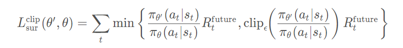
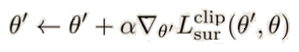
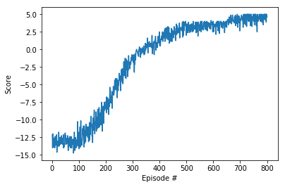

# Pong with PPO, Learning from Raw Pixels

### Introduction 

In this notebook, we implement an agent learning to play Pong with
algorithm PPO ([Proximal Policy Optimization](https://openai.com/blog/openai-baselines-ppo/)).  
As with the [REINFORCE version](https://github.com/Rafael1s/Deep-Reinforcement-Learning-Algorithms/tree/master/Pong-Policy-Gradient-REINFORCE), 
the model learns from pixels.

## Algorithm PPO 

I. Collect trajectories based on the policy \Pi(\theta'),  
initialize  \theta' = \theta.

II. Compute the gradient for the clipped surrogate function

III. Gradient ascent, update \theta':

IV. The internal loop of the PPO training: Steps II and III are repeated _k_ times,      
i.e., every trajectory is used _k_ times before it is trown away. In our case, _k_ = 4.    
For the case REINFORCE, _k_ = 1. In the code,  _k_ = _SGD_\__epoch_,  see file _pong_\__utils.py_,    
function _clipped_\__surrogate_.

V. External loop: back to step 1. Set \theta=\theta',
 go to new epsodes with new trajectories.
 
 ### Rewards
 
 RL uses the idea of rewards in order to determine which actions to perform.      
 The reward is simply a +1 for every round the Agent wins, and a -1 for every round the opponent CPU wins.   
 For more [complex games](https://towardsdatascience.com/intro-to-reinforcement-learning-pong-92a94aa0f84d), rewards can be tied to score increments. In real-life applications  computing rewards    
 can be trickier,  especially when there is no obvious single score or objective to optimize.   
 
### Training the Agent

The environment was solved:

  * Input: 800 episodes and tmax = 300   
    Result: score = **4.625**,  Running time - **56m**    
     
   
### Parallel Environmnets   

The training is performed by **8 parallel agents**. The agents run in    
8 independent environments and learn the same Neural Network.

     envs = parallelEnv('PongDeterministic-v4', n=8)
   
### Other PPO projects  
  * [CarRacing](../CarRacing-From-Pixels-PPO),  Single agent, Learning from pixels
  * [C r a w l e r  ](../Project-2_Continuous-Control-Crawler-PPO), 12 parallel agents
  * [BipedalWalker](../BipedalWalker-PPO-VectorizedEnv),   16 parallel agents

## Credit       
The implementation of the PPO algorithm code is based on the Udacity code.  
