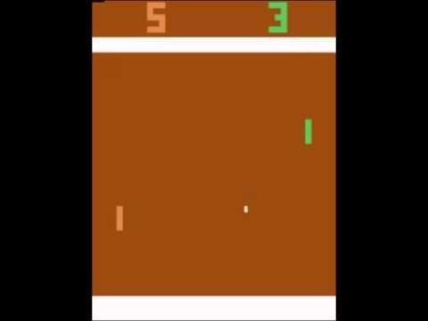
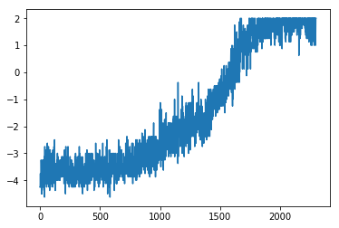
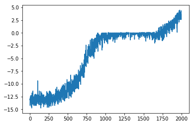
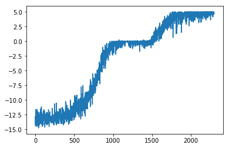

# Pong with REINFORCE

## Introduction

In this notebook, we implement an agent learning to play **Pong**.
The training uses policy gradients. We train on a GPU.
The  model described in [Deep Reinforcement Learning: 
Pong from Pixels](http://karpathy.github.io/2016/05/31/rl/), 
which contains an introduction and background to this model.

## Algorithm REINFORCE

Algorithm REINFORCE can be briefly described  as the loop of 3 components:

### Line 1.

Here, **\tau^i** are the trajectories of steps **(a_t,s_t)** , and **\pi_\theta(a_t, s_t)**
are probabilities (depending on the weights \theta) of the
action **a^i_t** if the last state was **s^i_t**.  In this component, 
the algorithm collects the data, see the function

     def collect_trajectories(envs, policy, tmax=200, nrand=5)

in _pong_util.py_.  Here, tmax  is the length of the trajectory (parameter also
known as _horizon_) The function _collect_\__trajectories_ performs
5 random steps (in the RIGHT or LEFT) and get 2 consecutive frames
_fr1_ and _fr2_.  The function _preprocess_\__batch_ crops image and downsample 
to 80x80 stack of two black-white frames together as input.
The probabilies _probs_ returned from the finction _policy_ are given only 
for the action LEFT, the probability for the RIGHT are calculated as
1 - _probs_.  

### Line 2.

Here, _J(\theta)_ is the calculated expected return,
see the function

     def surrogate(policy, old_probs, states, actions, rewards, \
              discount = 0.995, beta=0.01)

The value _J(\theta)_ is the discounted sum. Further, in this component, 
log-probabilities as a part of the gradient function (in line 2) are calculated.

### Line 3.

Here, we use the the **gradient ascent** mechanism,
which is realised in pong-REINFORCE notebook, in the traing lines

    L = -pong_utils.surrogate(model, old_probs, states, actions, rewards, beta=beta)
    optimizer.zero_grad()
    L.backward()
    optimizer.step()

Here, L means the **loss function** (depending on \theta).

### Training the Agent

The environment was solved, see the following results.

  1. Input: 2300 episodes and tmax = 100   
   Result: score = **1.77**,  Running time - **1h.50m**    
       
   
  2. Input: 2000 episodes and tmax = 300    
   Result: score = **2.84**,  Running time - **4h.30m**       
      
     
  3. Input: 2300 episodes and tmax = 300   
   Result: score = **4.82**,  Running time - **5h.11m**     
      
      

### Credit   

Most of the code is based on the Udacity code for the REINFORCE algorithm.

