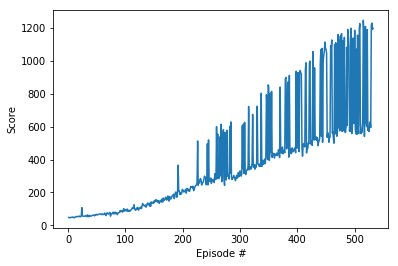

## Project 2: Continuous Control (Crawler)   

### Introduction

For this project, we work with the [Crawler](https://github.com/Unity-Technologies/ml-agents/blob/master/docs/Learning-Environment-Examples.md#crawler)    
environment. 

### Training History

 * Case 1.  
   
   
 * Case 2.   
   
     
 * Case 3.   
   
      
 * Case 4.   
   
   
   