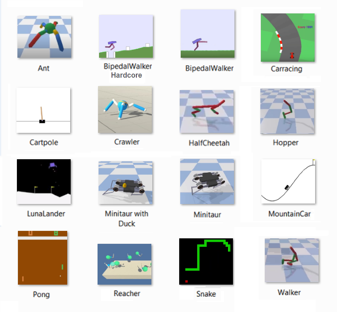

## Deep Reinforcement Learning Algorithms

Here you can find several projects dedicated to the Deep Reinforcement Learning methods.     
The projects are deployed in the matrix form: **[env x model]**, where **env** is the environment   
to be solved, and **model** is the model/algorithm which solves this environment. In some cases,    
the same environment is resolved by several algorithms. All projects are presented as   
a **jupyter notebook** containing **training log**.  

The following environments are supported:  

__AntBulletEnv__,  __BipedalWalker__, __BipedalWalkerHardcore__, __CarRacing__, __CartPole__, __Crawler__, __HalfCheetahBulletEnv__,   
__HopperBulletEnv__,  __LunarLander__,  __LunarLanderContinuous__,  __Markov Decision 6x6__,  __Minitaur__, __Minitaur with Duck__,      
__MountainCar__, __MountainCarContinuous__, __Pong__, __Navigation__, __Reacher__,  __Snake__,  __Tennis__, __Waker2DBulletEnv__.   

Four environments (__Navigation__,  __Crawler__, __Reacher__,  __Tennis__) are solved in the framework of the   
[**_Udacity Deep Reinforcement Learning Nanodegree Program_**](https://www.udacity.com/course/deep-reinforcement-learning-nanodegree--nd893).  
 
* [_Monte-Carlo Methods_](https://medium.com/@zsalloum/monte-carlo-in-reinforcement-learning-the-easy-way-564c53010511)       
In Monte Carlo (MC), we play episodes of the game until we reach the end, we grab the rewards     
collected on the way and move backward to the start of the episode. We repeat this method   
a sufficient number of times and we average  the value of each state.   
* [_Temporal Difference Methods and Q-learning_](https://en.wikipedia.org/wiki/Temporal_difference_learning)
* [_Reinforcement Learning in Continuous Space (Deep Q-Network)_](https://en.wikipedia.org/wiki/Reinforcement_learning)
* [_Function Approximation and Neural Network_](https://medium.com/biffures/rl-course-by-david-silver-lectures-5-to-7-576188d3b033)    
The [Universal Approximation Theorem (UAT) states](https://towardsdatascience.com/the-approximation-power-of-neural-networks-with-python-codes-ddfc250bdb58) that feed-forward _neural networks_ containing a     
_single hidden layer_ with a finite number of nodes can be used to approximate any continuous function     
provided rather mild assumptions about the form of the activation function are satisfied.
* [_Policy-Based Methods_](https://towardsdatascience.com/policy-based-reinforcement-learning-the-easy-way-8de9a3356083), [_Hill-Climbing_](https://en.wikipedia.org/wiki/Hill_climbing), [_Simulating Annealing_](https://medium.com/@macromoltek/machine-learning-and-simulated-annealing-588b2e70d0cc)     
Random-restart _hill-climbing_ is a surprisingly effective algorithm in many cases.  _Simulated annealing_ is a good    
probabilistic technique because it does not accidentally think a local extrema is a global extrema.
* [_Policy-Gradient Methods_](https://lilianweng.github.io/lil-log/2018/04/08/policy-gradient-algorithms.html), [_REINFORCE_](https://medium.com/samkirkiles/reinforce-policy-gradients-from-scratch-in-numpy-6a09ae0dfe12), [_PPO_](https://arxiv.org/abs/1707.06347)    
Define a performance measure _J(\theta)_ to maximaze. Learn policy paramter \theta throgh _approximate gradient ascent_.    

* [_Actor-Critic Methods_](https://towardsdatascience.com/soft-actor-critic-demystified-b8427df61665), [_A3C_](https://medium.com/emergent-future/simple-reinforcement-learning-with-tensorflow-part-8-asynchronous-actor-critic-agents-a3c-c88f72a5e9f2), [_A2C_](https://hackernoon.com/intuitive-rl-intro-to-advantage-actor-critic-a2c-4ff545978752), [_DDPG_](https://medium.com/@amitpatel.gt/policy-gradients-1edbbbc8de6b), [_TD3_](https://arxiv.org/abs/1802.09477), [_SAC_](https://towardsdatascience.com/soft-actor-critic-demystified-b8427df61665)    
The key difference from A2C is the Asynchronous part. A3C consists of multiple independent agents(networks) with   
their own weights, who interact with a different copy of the environment in parallel. Thus, they can explore    
a bigger part of the state-action space in much less time.  
* [_Forward-Looking Actor or FORK_](https://arxiv.org/abs/2010.01652)    
Model-based reinforcement learning uses the model in a sophisticated way, often based   
on deterministic or stochastic optimal control theory to optimize the policy based   
on the model. FORK only uses the _system network_ as a blackbox  to forecast future states,   
and does not use it as a mathematical model for optimizing control actions.     
With this key distinction, any model-free Actor-Critic algorithm with FORK  remains  
to be model-free.  

### Projects, models and methods

[AntBulletEnv, Soft Actor-Critic (SAC)](https://github.com/Rafael1s/Deep-Reinforcement-Learning-Algorithms/tree/master/Ant-PyBulletEnv-Soft-Actor-Critic)    

[BipedalWalker, Twin Delayed DDPG (TD3)](https://github.com/Rafael1s/Deep-Reinforcement-Learning-Algorithms/tree/master/BipedalWalker-TwinDelayed-DDPG%20(TD3))     

[BipedalWalker, PPO, Vectorized Environment](https://github.com/Rafael1s/Deep-Reinforcement-Learning-Algorithms/blob/master/BipedalWalker-PPO-VectorizedEnv)

[BipedalWalker, Soft Actor-Critic (SAC)](https://github.com/Rafael1s/Deep-Reinforcement-Learning-Algorithms/tree/master/BipedalWalker-Soft-Actor-Critic)

[BipedalWalker, A2C, Vectorized Environment](https://github.com/Rafael1s/Deep-Reinforcement-Learning-Algorithms/tree/master/BipedalWalker-A2C-VectorizedEnv)

[CarRacing with PPO, Learning from Raw Pixels](https://github.com/Rafael1s/Deep-Reinforcement-Learning-Algorithms/blob/master/CarRacing-From-Pixels-PPO)

[CartPole, Policy Based Methods, Hill Climbing](https://github.com/Rafael1s/Deep-Reinforcement-Learning-Algorithms/tree/master/CartPole-Policy-Based-Hill-Climbing)    

[CartPole, Policy Gradient Methods, REINFORCE](https://github.com/Rafael1s/Deep-Reinforcement-Learning-Algorithms/tree/master/CartPole-Policy-Gradient-Reinforce)   

[Cartpole, DQN](https://github.com/Rafael1s/Deep-Reinforcement-Learning-Algorithms/tree/master/Cartpole-Deep-Q-Learning)  

[Cartpole, Double DQN](https://github.com/Rafael1s/Deep-Reinforcement-Learning-Algorithms/tree/master/Cartpole-Double-Deep-Q-Learning)   

[HalfCheetahBulletEnv, Twin Delayed DDPG (TD3)](https://github.com/Rafael1s/Deep-Reinforcement-Learning-Algorithms/tree/master/HalfCheetahBulletEnv-TD3)   

[HopperBulletEnv, Twin Delayed DDPG (TD3)](https://github.com/Rafael1s/Deep-Reinforcement-Learning-Algorithms/tree/master/HopperBulletEnv_v0-TD3)  

[HopperBulletEnv, Soft Actor-Critic (SAC)](https://github.com/Rafael1s/Deep-Reinforcement-Learning-Algorithms/tree/master/HopperBulletEnv-v0-SAC)  

[LunarLander-v2, DQN](https://github.com/Rafael1s/Deep-Reinforcement-Learning-Algorithms/tree/master/LunarLander-v2-DQN)

[LunarLanderContinuous-v2, DDPG](https://github.com/Rafael1s/Deep-Reinforcement-Learning-Algorithms/tree/master/LunarLanderContinuous-v2-DDPG)

[Markov Decision Process, Monte-Carlo, Gridworld 6x6](https://github.com/Rafael1s/Deep-Reinforcement-Learning-Algorithms/tree/master/Markov-Decision-Process_6x6)  

[MinitaurBulletEnv, Soft Actor-Critic (SAC)](https://github.com/Rafael1s/Deep-Reinforcement-Learning-Algorithms/tree/master/Minitaur-Soft-Actor-Critic)

[MinitaurBulletDuckEnv, Soft Actor-Critic (SAC)](https://github.com/Rafael1s/Deep-Reinforcement-Learning-Algorithms/tree/master/MinitaurDuck-Soft-Actor-Critic)   

[MountainCar, Q-learning](https://github.com/Rafael1s/Deep-Reinforcement-Learning-Algorithms/tree/master/MountainCar-Q-Learning)    

[MountainCar, DQN](https://github.com/Rafael1s/Deep-Reinforcement-Learning-Algorithms/tree/master/MountainCar-DQN)   

[MountainCarContinuous, Twin Delayed DDPG (TD3)](https://github.com/Rafael1s/Deep-Reinforcement-Learning-Algorithms/tree/master/MountainCarContinuous-TD3)   

[MountainCarContinuous, PPO, Vectorized Environment](https://github.com/Rafael1s/Deep-Reinforcement-Learning-Algorithms/tree/master/MountainCarContinuous_PPO)   

[Pong, Policy Gradient Methods, PPO](https://github.com/Rafael1s/Deep-Reinforcement-Learning-Algorithms/tree/master/Pong-Policy-Gradient-PPO)      

[Pong, Policy Gradient Methods, REINFORCE](https://github.com/Rafael1s/Deep-Reinforcement-Learning-Algorithms/tree/master/Pong-Policy-Gradient-REINFORCE)   

[Snake, DQN, Pygame](https://github.com/Rafael1s/Deep-Reinforcement-Learning-Algorithms/tree/master/Snake-Pygame-DQN)

[Udacity Project 1: Navigation, DQN, ReplayBuffer](https://github.com/Rafael1s/Deep-Reinforcement-Learning-Algorithms/tree/master/Project-1_Navigation-DQN)   

[Udacity Project 2: Continuous Control-Reacher, DDPG](https://github.com/Rafael1s/Deep-Reinforcement-Learning-Algorithms/tree/master/Project-2_Continuous-Control-Reacher-DDPG), environment [Reacher (Double-Jointed-Arm)](https://github.com/Unity-Technologies/ml-agents/blob/master/docs/Learning-Environment-Examples.md#reacher)    

[Udacity Project 2: Continuous Control-Crawler, PPO](https://github.com/Rafael1s/Deep-Reinforcement-Learning-Algorithms/tree/master/Project-2_Continuous-Control-Crawler-PPO), environment [Crawler](https://github.com/Unity-Technologies/ml-agents/blob/master/docs/Learning-Environment-Examples.md#crawler)    
     
[Udacity Project 3: Collaboration_Competition-Tennis, Multi-agent DDPG](https://github.com/Rafael1s/Deep-Reinforcement-Learning-Algorithms/tree/master/Project-3_Collaboration_Competition-Tennis-Maddpg), environment [Tennis](https://github.com/Unity-Technologies/ml-agents/blob/master/docs/Learning-Environment-Examples.md#tennis)     

[Walker2DBulletEnv, Twin Delayed DDPG (TD3)](https://github.com/Rafael1s/Deep-Reinforcement-Learning-Algorithms/tree/master/Walker2DBulletEnv-v0_TD3)   

[Walker2DBulletEnv, Soft Actor-Critic (SAC)](https://github.com/Rafael1s/Deep-Reinforcement-Learning-Algorithms/tree/master/Walker2DBulletEnv-v0_SAC)

### Projects with DQN and Double DQN

* [Cartpole, DQN](https://github.com/Rafael1s/Deep-Reinforcement-Learning-Algorithms/tree/master/Cartpole-Deep-Q-Learning)    
* [Cartpole, Double DQN](https://github.com/Rafael1s/Deep-Reinforcement-Learning-Algorithms/tree/master/Cartpole-Double-Deep-Q-Learning)  
* [LunarLander-v2, DQN](https://github.com/Rafael1s/Deep-Reinforcement-Learning-Algorithms/tree/master/LunarLander-v2-DQN)   
* [MountainCar, DQN](https://github.com/Rafael1s/Deep-Reinforcement-Learning-Algorithms/tree/master/MountainCar-DQN)
* [Navigation, DQN](https://github.com/Rafael1s/Deep-Reinforcement-Learning-Algorithms/tree/master/Project-1_Navigation-DQN)      
* [Snake, DQN, Pygame](https://github.com/Rafael1s/Deep-Reinforcement-Learning-Algorithms/tree/master/Snake-Pygame-DQN)
  
### Projects with PPO
  * [BipedalWalker](https://github.com/Rafael1s/Deep-Reinforcement-Learning-Algorithms/tree/master//BipedalWalker-PPO-VectorizedEnv),  16 environments   
  * [CarRacing](https://github.com/Rafael1s/Deep-Reinforcement-Learning-Algorithms/tree/master/CarRacing-From-Pixels-PPO),  Single environment, Learning from pixels   
  * [C r a w l e r  ](https://github.com/Rafael1s/Deep-Reinforcement-Learning-Algorithms/tree/master/Project-2_Continuous-Control-Crawler-PPO), 12 environments      
  * [MountainCarContinuous](https://github.com/Rafael1s/Deep-Reinforcement-Learning-Algorithms/tree/master/MountainCarContinuous_PPO), 16 environments
  * [Pong](https://github.com/Rafael1s/Deep-Reinforcement-Learning-Algorithms/tree/master/Pong-Policy-Gradient-PPO), 8 environments    

### Projects with TD3
  * [BipedalWalker](https://github.com/Rafael1s/Deep-Reinforcement-Learning-Algorithms/tree/master/BipedalWalker-TwinDelayed-DDPG%20(TD3))    
  * [HalfChhetahBulletEnv](https://github.com/Rafael1s/Deep-Reinforcement-Learning-Algorithms/tree/master/HalfCheetahBulletEnv-TD3)     
  * [HopperBulletEnv](https://github.com/Rafael1s/Deep-Reinforcement-Learning-Algorithms/tree/master/HopperBulletEnv_v0-TD3)    
  * [MountainCarContinuous](https://github.com/Rafael1s/Deep-Reinforcement-Learning-Algorithms/tree/master/MountainCarContinuous-TD3)   
  * [Walker2DBulletEnv](https://github.com/Rafael1s/Deep-Reinforcement-Learning-Algorithms/tree/master/Walker2DBulletEnv-v0_TD3)   
  
 ### Projects with Soft Actor-Critic (SAC)
 * [AntBulletEnv](https://github.com/Rafael1s/Deep-Reinforcement-Learning-Algorithms/tree/master/Ant-PyBulletEnv-Soft-Actor-Critic)   
 * [BipedalWalker](https://github.com/Rafael1s/Deep-Reinforcement-Learning-Algorithms/tree/master/BipedalWalker-Soft-Actor-Critic)   
 * [HopperBulletEnv](https://github.com/Rafael1s/Deep-Reinforcement-Learning-Algorithms/tree/master/HopperBulletEnv-v0-SAC)   
 * [MinitaurBulletEnv](https://github.com/Rafael1s/Deep-Reinforcement-Learning-Algorithms/tree/master/Minitaur-Soft-Actor-Critic)   
 * [MinitaurBulletDuckEnv](https://github.com/Rafael1s/Deep-Reinforcement-Learning-Algorithms/tree/master/MinitaurDuck-Soft-Actor-Critic)
 * [Walker2dBulletEnv](https://github.com/Rafael1s/Deep-Reinforcement-Learning-Algorithms/tree/master/Walker2DBulletEnv-v0_SAC)   
 
  
 ###  BipedalWalker, different models
  
* [BipedalWalker, Twin Delayed DDPG (TD3)](https://github.com/Rafael1s/Deep-Reinforcement-Learning-Algorithms/tree/master/BipedalWalker-TwinDelayed-DDPG%20(TD3))     
* [BipedalWalker, PPO, Vectorized Environment](https://github.com/Rafael1s/Deep-Reinforcement-Learning-Algorithms/blob/master/BipedalWalker-PPO-VectorizedEnv)   
* [BipedalWalker, Soft-Actor-Critic (SAC)](https://github.com/Rafael1s/Deep-Reinforcement-Learning-Algorithms/tree/master/BipedalWalker-Soft-Actor-Critic)    
* [BipedalWalker, A2C, Vectorized Environment](https://github.com/Rafael1s/Deep-Reinforcement-Learning-Algorithms/tree/master/BipedalWalker-A2C-VectorizedEnv)  

### CartPole, different models

* [CartPole, Policy Based Methods, Hill Climbing](https://github.com/Rafael1s/Deep-Reinforcement-Learning-Algorithms/tree/master/CartPole-Policy-Based-Hill-Climbing)    
* [CartPole, Policy Gradient Methods, REINFORCE](https://github.com/Rafael1s/Deep-Reinforcement-Learning-Algorithms/tree/master/CartPole-Policy-Gradient-Reinforce)   
* [Cartpole with Deep Q-Learning](https://github.com/Rafael1s/Deep-Reinforcement-Learning-Algorithms/tree/master/Cartpole-Deep-Q-Learning)   
* [Cartpole with Doouble Deep Q-Learning](https://github.com/Rafael1s/Deep-Reinforcement-Learning-Algorithms/tree/master/Cartpole-Double-Deep-Q-Learning)    

### For more links 

  * on _Policy-Gradient Methods_, see [1](https://medium.com/@jonathan_hui/rl-policy-gradients-explained-9b13b688b146), [2](https://towardsdatascience.com/an-intuitive-explanation-of-policy-gradient-part-1-reinforce-aa4392cbfd3c), [3](https://towardsdatascience.com/policy-gradients-in-a-nutshell-8b72f9743c5d).
  * on _REINFORCE_, see [1](https://towardsdatascience.com/an-intuitive-explanation-of-policy-gradient-part-1-reinforce-aa4392cbfd3c),
  [2](http://karpathy.github.io/2016/05/31/rl/), [3](https://medium.com/mini-distill/discrete-optimization-beyond-reinforce-5ca171bebf17).       
  * on _PPO_,  see [1](https://medium.com/arxiv-bytes/summary-proximal-policy-optimization-ppo-86e41b557a8b), [2](https://openai.com/blog/openai-baselines-ppo/), [3](https://towardsdatascience.com/the-pursuit-of-robotic-happiness-how-trpo-and-ppo-stabilize-policy-gradient-methods-545784094e3b), [4](https://medium.com/@jonathan_hui/rl-proximal-policy-optimization-ppo-explained-77f014ec3f12), [5](https://towardsdatascience.com/introduction-to-various-reinforcement-learning-algorithms-part-ii-trpo-ppo-87f2c5919bb9).        
  * on _DDPG_, see [1](https://towardsdatascience.com/introduction-to-various-reinforcement-learning-algorithms-i-q-learning-sarsa-dqn-ddpg-72a5e0cb6287), [2](https://spinningup.openai.com/en/latest/algorithms/ddpg.html#the-q-learning-side-of-ddpg).        
  * on _Actor-Critic Methods_, and _A3C_, see [1](https://towardsdatascience.com/advanced-reinforcement-learning-6d769f529eb3), [2](https://blog.goodaudience.com/a3c-what-it-is-what-i-built-6b91fe5ec09c), [3](https://towardsdatascience.com/understanding-actor-critic-methods-931b97b6df3f), [4](http://papers.nips.cc/paper/1786-actor-critic-algorithms.pdf).          
   * on _TD3_, see [1](https://arxiv.org/abs/1802.09477), [2](https://spinningup.openai.com/en/latest/algorithms/td3.html), [3](https://stable-baselines.readthedocs.io/en/master/modules/td3.html)    
   * on _SAC_, see [1](https://arxiv.org/abs/1801.01290), [2](https://towardsdatascience.com/soft-actor-critic-demystified-b8427df61665), [3](https://stable-baselines.readthedocs.io/en/master/modules/sac.html), [4](https://spinningup.openai.com/en/latest/algorithms/sac.html), [5](https://sites.google.com/view/sac-and-applications)     
   * on _A2C_,  see [1](https://towardsdatascience.com/understanding-actor-critic-methods-931b97b6df3f), [2](https://openai.com/blog/baselines-acktr-a2c/), [3](https://sergioskar.github.io/Actor_critics/), [4](https://stable-baselines.readthedocs.io/en/master/modules/a2c.html), [5](https://hackernoon.com/intuitive-rl-intro-to-advantage-actor-critic-a2c-4ff545978752)      

### My articles on TowardsDataScience

* [How does the Bellman equation work in Deep Reinforcement Learning?](https://towardsdatascience.com/how-the-bellman-equation-works-in-deep-reinforcement-learning-5301fe41b25a)  
* [A pair of interrelated neural networks in Deep Q-Network](https://towardsdatascience.com/a-pair-of-interrelated-neural-networks-in-dqn-f0f58e09b3c4)    
* [Three aspects of Deep Reinforcement Learning: noise, overestimation and exploration](https://towardsdatascience.com/three-aspects-of-deep-rl-noise-overestimation-and-exploration-122ffb4bb92b)      
* [Entropy in Soft Actor-Critic (Part 1)](https://towardsdatascience.com/entropy-in-soft-actor-critic-part-1-92c2cd3a3515)   
* [Entropy in Soft Actor-Critic (Part 2)](https://towardsdatascience.com/entropy-in-soft-actor-critic-part-2-59821bdd5671)

### Videos I have developed within the above projects
* [Four BipedalWalker Gaits](https://www.youtube.com/watch?v=PFixqZEYKh4)      
* [BipedalWalker by Training Stages](https://www.youtube.com/watch?v=g01mIFbxVns)  
* [CarRacing by Training Stages](https://www.youtube.com/watch?v=55buBR2pPdc)
* [Lucky Hopper](https://www.youtube.com/watch?v=Ipctq89yLB0)
* [Martian Ant](https://www.youtube.com/watch?v=s7aMZ1bbQgk)
* [Lunar Armada](https://www.youtube.com/watch?v=6O6g9LCWvIs)
* [Wooden Snake](https://www.youtube.com/watch?v=-T4wQirNDRo)
* [Walking through the chess fields](https://www.youtube.com/watch?v=qUT3TznKWAk)
* [Artificial snake on the way](https://www.youtube.com/watch?v=-jNfUrVniNg)
* [Learned Long Snake](https://www.youtube.com/watch?v=Tt1rqWTR8ZA)
* [Such a fast cheetah](https://www.youtube.com/watch?v=Q-FchLEZKRk)
* [Four stages of Minitaur training](https://www.youtube.com/watch?v=uEAqyEwvi54)
* [Chessboard chase with four Pybullet actors](https://www.youtube.com/watch?v=NXX4GTim_NM)
* [You can sleep while I drive, Minitaur with Duck](https://www.youtube.com/watch?v=_7_Rke5R3JQ)

