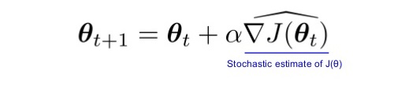

## Deep Reinforcement Learning Nanodegree Udacity

Here you can find several projects dedicated to the Deep Reinforcement Learnin methods.   
These projects are developed as part of the [**_Udacity Deep Reinforcement Learning Nanodegree Program_**](https://www.udacity.com/course/deep-reinforcement-learning-nanodegree--nd893).    
Several projects are devoted to [**_Deep Reinforcement Learning Architectures_**](https://arxiv.org/pdf/1806.08894.pdf), 
[**_Value-Based Methods and Bellman Equation_**](https://medium.com/@jonathan_hui/rl-value-learning-24f52b49c36d), 
[**_Policy-Based Methods_**](https://towardsdatascience.com/policy-based-reinforcement-learning-the-easy-way-8de9a3356083), 
[**_Policy-Gradient Methods_**](https://towardsdatascience.com/policy-gradients-in-a-nutshell-8b72f9743c5d) and 
[**_Actor-Critic_**](https://towardsdatascience.com/understanding-actor-critic-methods-931b97b6df3f) Methods.

* [_Monte-Carlo Methods_](https://medium.com/@zsalloum/monte-carlo-in-reinforcement-learning-the-easy-way-564c53010511)       
In Monte Carlo (MC), we play episodes of the game until we reach the end, we grab the rewards collected on the way   
and move backward  to the start of the episode. We repeat this method a sufficient number of times and we average    
the value of each state.   
* [_Temporal Difference Methods and Q-learning_](https://en.wikipedia.org/wiki/Temporal_difference_learning)
* [_Reinforcement Learning in Continuous Space (Deep Q-Network)_](https://en.wikipedia.org/wiki/Reinforcement_learning)
* [_Function Approximation and Neural Network_](https://medium.com/biffures/rl-course-by-david-silver-lectures-5-to-7-576188d3b033)    
The [Universal Approximation Theorem (UAT) states](https://towardsdatascience.com/the-approximation-power-of-neural-networks-with-python-codes-ddfc250bdb58) that feed-forward _neural networks_ containing a  
_single hidden layer_ with a finite number of nodes can be used to approximate any continuous function provided      
rather mild assumptions about the form of the activation function are satisfied.
* [_Policy-Based Methods_](https://towardsdatascience.com/policy-based-reinforcement-learning-the-easy-way-8de9a3356083), [_Hill Climbing_](https://en.wikipedia.org/wiki/Hill_climbing), [_Simulating Annealing_](https://medium.com/@macromoltek/machine-learning-and-simulated-annealing-588b2e70d0cc)     
Random-restart _hill climbing_ is a surprisingly effective algorithm in many cases.  _Simulated annealing_ is a good probabilistic     technique because it does not accidentally think a local extrema is a global extrema.
* [_Policy-Gradient Methods_](https://medium.com/@jonathan_hui/rl-policy-gradients-explained-9b13b688b146), [_REINFORCE_](https://medium.com/samkirkiles/reinforce-policy-gradients-from-scratch-in-numpy-6a09ae0dfe12), [_PPO_](https://medium.com/arxiv-bytes/summary-proximal-policy-optimization-ppo-86e41b557a8b)    
Define a performance measure _J(\theta)_ to maximaze. Learn policy paramter \theta throgh _approximate gradient ascent_.    

* [_Actor-Critic Methods_](https://towardsdatascience.com/soft-actor-critic-demystified-b8427df61665), [_A3C_](https://medium.com/emergent-future/simple-reinforcement-learning-with-tensorflow-part-8-asynchronous-actor-critic-agents-a3c-c88f72a5e9f2), [_A2C_](https://hackernoon.com/intuitive-rl-intro-to-advantage-actor-critic-a2c-4ff545978752), [_DDPG_](https://medium.com/@amitpatel.gt/policy-gradients-1edbbbc8de6b)    
The key difference from A2C is the Asynchronous part. A3C consists of multiple independent agents(networks) with   
their own weights, who interact with a different copy of the environment in parallel. Thus, they can explore    
a bigger part of the state-action space in much less time.

### Projects, models and methods

[CartPole, Policy Based Methods, Hill Climbing](https://github.com/Rafael1s/Deep-Reinforcement-Learning-Udacity/tree/master/CartPole-Policy-Based-Hill-Climbing)    

[CartPole, Policy Gradient Methods, REINFORCE](https://github.com/Rafael1s/Deep-Reinforcement-Learning-Udacity/tree/master/CartPole-Policy-Gradient-Reinforce)

[Markov Decision Process, Monte-Carlo, Gridworld 6x6](https://github.com/Rafael1s/Deep-Reinforcement-Learning-Udacity/tree/master/Markov-Decision-Process_6x6)

[Project 1: Navigation, Deep-Q-Network, ReplayBuffer](https://github.com/Rafael1s/Deep-Reinforcement-Learning-Udacity/tree/master/Project-1_Navigation)

[Project 2: Continuous Control-Reacher, DDPG](https://github.com/Rafael1s/Deep-Reinforcement-Learning-Udacity/tree/master/Project-2_Continuous-Control-Double-Joined-Arm)    

* uses environment [Reacher (Double-Jointed-Arm)](https://github.com/Unity-Technologies/ml-agents/blob/master/docs/Learning-Environment-Examples.md#reacher)

[Project 2: Continuous Control-Crawler, PPO](https://github.com/Rafael1s/Deep-Reinforcement-Learning-Udacity/tree/master/Project-2_Continuous-Control-Crawler)    

* uses environment [Crawler](https://github.com/Unity-Technologies/ml-agents/blob/master/docs/Learning-Environment-Examples.md#crawler)   
