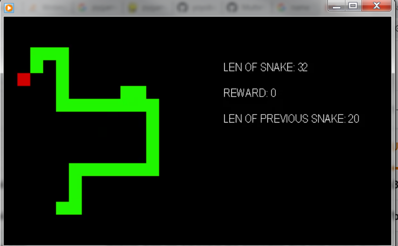

# Project - Snake with Deep Q-Network, Pytorch, Pygame

### Rewards

The total reward is calculated for each episode, which is continued for 30 games.   
We collect average total reward for every 100 consecutive episodes. The threshold is unknown.    
The snake's length and reward increase by 1 each time an apple is eaten.    
The reward is reduced by 1 every time the snake collides with itself,    
bumps into the border of the board, or if it does not eat an apple for a long time. 

