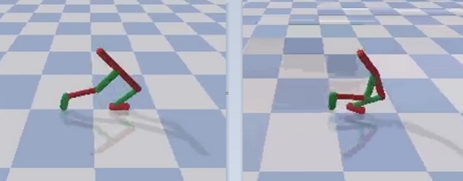
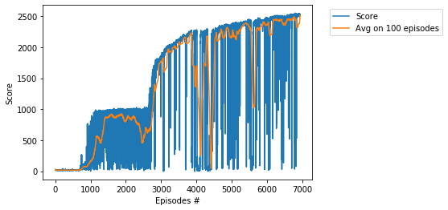

# Project - Walker2DBulletEnv with Soft Actor-Critic (SAC)

### Environment  

Solving the environment require an average total reward of over **2500** on 100 consecutive episodes.    
Training of Walker2DBulletEnv is performed using the __Soft Actor-Critic (SAC)__ algorithm, see    
two basic papers [SAC: Off-Policy Maximum Entropy Deep RL with a Stochastic Actor](https://arxiv.org/abs/1801.01290)     
and [SAC Algorithms and Applications](https://arxiv.org/abs/1812.05905).  We solve the HopperBulletEnv environment in **6934 episodes**, in __75.5__ hours.    
By usage of the [Twin Delayed DDPG (TD3) algorithm](https://github.com/Rafael1s/Deep-Reinforcement-Learning-Algorithms/tree/master/Walker2DBulletEnv-v0_TD3), the environment is solved in **9361 episodes**.  

### Training Score

   

### Other SAC projects

* [AntBulletEnv](https://github.com/Rafael1s/Deep-Reinforcement-Learning-Algorithms/tree/master/Ant-PyBulletEnv-Soft-Actor-Critic)   
* [BipedalWalker](https://github.com/Rafael1s/Deep-Reinforcement-Learning-Algorithms/tree/master/BipedalWalker-Soft-Actor-Critic)   
* [HopperBulletEnv](https://github.com/Rafael1s/Deep-Reinforcement-Learning-Algorithms/tree/master/HopperBulletEnv-v0-SAC)   
* [MinitaurBulletEnv](https://github.com/Rafael1s/Deep-Reinforcement-Learning-Algorithms/tree/master/Minitaur-Soft-Actor-Critic)   
* [MinitaurBulletDuckEnv](https://github.com/Rafael1s/Deep-Reinforcement-Learning-Algorithms/tree/master/MinitaurDuck-Soft-Actor-Critic)   

### The last few lines from the log

...    
Ep.: 6923, Total Steps: 5164722, Ep.Steps: 1000, Score: 2510.848, Avg.Score: 2434.984, Max.Score: 2544.886, Time: 75:18:42   
Ep.: 6924, Total Steps: 5165722, Ep.Steps: 1000, Score: 2511.237, Avg.Score: 2458.445, Max.Score: 2544.886, Time: 75:19:39    
Ep.: 6925, Total Steps: 5166722, Ep.Steps: 1000, Score: 2531.342, Avg.Score: 2458.312, Max.Score: 2544.886, Time: 75:20:32    
Ep.: 6926, Total Steps: 5167722, Ep.Steps: 1000, Score: 2527.584, Avg.Score: 2458.944, Max.Score: 2544.886, Time: 75:21:24    
Ep.: 6927, Total Steps: 5168722, Ep.Steps: 1000, Score: 2533.325, Avg.Score: 2459.297, Max.Score: 2544.886, Time: 75:22:16   
Ep.: 6928, Total Steps: 5169722, Ep.Steps: 1000, Score: 2533.813, Avg.Score: 2459.911, Max.Score: 2544.886, Time: 75:23:08   
Ep.: 6929, Total Steps: 5170722, Ep.Steps: 1000, Score: 2507.309, Avg.Score: 2459.618, Max.Score: 2544.886, Time: 75:23:59    
Ep.: 6930, Total Steps: 5171722, Ep.Steps: 1000, Score: 2522.629, Avg.Score: 2462.209, Max.Score: 2544.886, Time: 75:24:52    
Ep.: 6931, Total Steps: 5172722, Ep.Steps: 1000, Score: 2522.187, Avg.Score: 2480.560, Max.Score: 2544.886, Time: 75:25:44    
Ep.: 6932, Total Steps: 5173722, Ep.Steps: 1000, Score: 2527.365, Avg.Score: 2495.964, Max.Score: 2544.886, Time: 75:26:36    
Ep.: 6933, Total Steps: 5174722, Ep.Steps: 1000, Score: 2531.127, Avg.Score: 2516.000, Max.Score: 2544.886, Time: 75:27:28    
Solved environment with Avg Score:   2516.0003478152444    

###  Videos

See youtube videos:     
[Walking through the chess fields](https://www.youtube.com/watch?v=qUT3TznKWAk) and     
[Chessboard chase with four Pybullet actors](https://www.youtube.com/watch?v=NXX4GTim_NM).

### Credit   

Based on Pranjal Tandon's code (https://github.com/pranz24).
