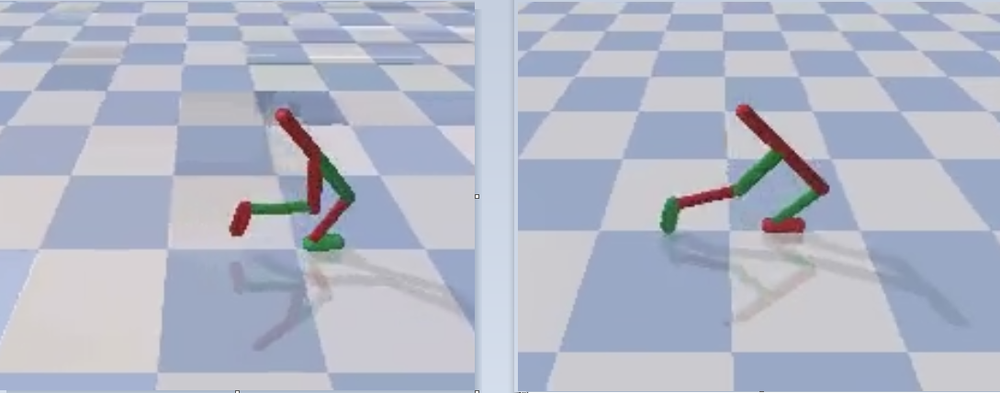

# Project - Walker2DBulletEnv with Twin Delayed DDPG (TD3)    

### Environment  

Solving the environment require an average total reward of over 2500 over 100 consecutive episodes.  
The environment is solved in __9361 episodes__
by usage of the __Twin Delayed DDPG (TD3)__ algorithm, see the basic paper [Addressing Function Approximation Error in Actor-Critic Methods](https://arxiv.org/abs/1802.09477).

